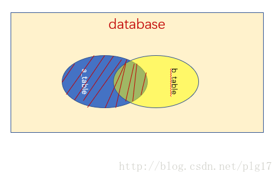
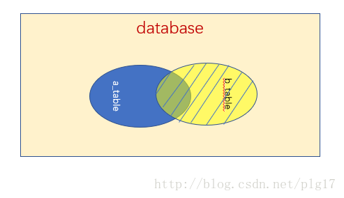
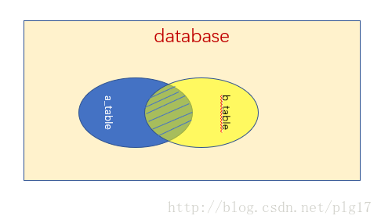

## MySQL 存储引擎
[TOC]
####1.1 存储引擎

####1.2 查看数据库服务支持的存储引擎
		show engines;
####1.3 设置数据库服务默认使用存储引擎
    ```#vim /etc/my.cnf
    [mysqld]
    default-storage-engine=myisam
    #show engines;
    ```
###### 修改已有的表使用的存储引擎
    alter table 表名 engine=存储引擎;
###### 定义表使用的存储引擎
    create table 表名 (字段名列表) engine=存储引擎;

####1.4 常用存储引擎的特点
	myisam存储引擎的特点
    	表名.frm desc 表名;
        表名.MYI index(name);
        表名.MYD select * from 表名;
        
        支持表级锁 不支持事物 不支持事务回滚 不支持外键
	 
     *锁模式
     	表共享读锁(Table Read Lock)
     	表独占写锁(Table Write Lock)
	 
     *如何加锁
     	当MyISAM在执行查询语句时,会自动给涉及到表 加读锁,在执行更新操作时候,会加写锁. 用户可以用LOCK TABLE 去显式加锁
	 
     *并发插入
      	MyISAM存储引擎有个系统变量 concurrent_insert，专门用来控制并发插入的行为，可以取 0 ， 1 ， 2。
		0表示不允许并发插入，1表示表中间没有删除的行时可以在表末尾插入，2表示总是可以插入。
        
        
       
	innodb存储引擎特点
    	表名.frm desc 表名;
        表名.ibd index(name)+select *from 表名;
        
        事务日志文件:记录对innodb存储引擎的表执行过的操作
            
            ib_logfile0
            ib_logfile1
            ibdata1
        
        支持行级锁定 支持事务 事务回滚 外键

	* 锁介绍
    * 锁模式
    	共享锁(S)
        排它锁(X)
        
     * 如何加锁
        可以显式的加锁，用lock in share mode 显式的加共享锁，用 for update 显式的加排他锁。
		需要注意的是，如果线程A加了共享锁后，线程B对同一个表加了共享锁，那么两个线程需要进行更新操作时会产生死锁。所以，进行更新操作时最好加排他锁。

      * InnoDB行锁的实现方式——索引加锁
		(重要)：1. 只有通过索引条件检索数据时，InnoDB才会使用行级锁，否则会使用表级锁。 2. 即使是访问不同行的记录，如果使用的是相同的索引键，会发生锁冲突。 3. 如果数据表建有多个索引时，可以通过不同的索引锁定不同的行。
    
    (4). 间隙锁
		InnoDB支持事务，为了满足隔离级别的要求，InnoDB有个间隙锁，当使用范围查找时，InnoDB会给满足key范围要求，但实际并不存在的记录加锁.  
        例如：select * from user where id > 100 for updata 会给ID>100的记录加排他锁，满足这个范围，但不存在的记录，会加间隙锁，这样可以避免幻读，避免读取的时候插入满足条件的记录。

	(5). 隔离级别与锁
		一般来说，隔离级别越高，加锁就越严格。这样，产生锁冲突的概率就越大，一般实际应用中，通过优化应用逻辑，选用 可提交读 级别就够了。对于一些确实需要更高隔离级别的事务，再通过set session transaction isolation level+"级别" 来动态改变满足需求。

    * 行级锁介绍
    	给访问的每一行记录分别加锁
    
    * 表级锁介绍
    	只要对表做访问,就把整张表加锁.
        为什么要加锁? 解决并发访问通途问题.
    * 事务介绍
    	对数据的一次访问
    * 事务回滚介绍
    	事务执行过程中任意一步操作失败,会恢复到之前的所有操作.

####1.5 生产环境下建表时如何决定表使用哪种存储引擎
	
- [x] 查询多的表使用MyISAM存储引擎. 							   节省系统资源
- [x]     写 (insert update delete)操作多的表适合使用innodb存储引擎  并发访问量大
    
####1.6 事务特性(==ACID==)
		
		* Atomic 原子性
		* 事务的整个操作是一个整体,不可分割,要么全部成功,要么全部失败.
		* Consistency 一致性
		* 事务操作前后,表中的记录没有变化.
		* Isolation 隔离性
		* 事务操作是相互隔离不受影响.
		* Durablility 持久性
		* 数据一旦提交,不可改变,永久改变表数据

		操作
        show variables like "autocommit"; //查看提交状况
        set autocommit=off;				  //关闭自动提交
        roolback; //数据回滚
        commit;	  //提交数据| column | column |
        
## 数据的导入/导出

### 2.1检索目录
+ 查看默认检索目录
    `show variables like "secure_file_priv"`
    
+ 修改默认检索目录
`vim /etc/my.cnf`
        [mysqld]
        secure_file_priv="/mydatadir"
```
mkdir /mydatadir;
chown mysql /mydatadir;
systemctl restart mysqld
```

### 2.2 数据导入
+ 命令格式
```
LOAD DATA INFILE "目录名/文件名" INTO TABLE 表名 FILEDS TERMINATED BY "分隔符" LINES TERMINATED BY "\n";
```
+ 注意事项
	- 字段分隔符要与文件内的一致
	- 指定导入文件的绝对路径
	- 导入数据的表字段类型要与文件字段匹配
	- 禁用SElinux
+ 数据导入 列子
	  把/etc/passwd 文件的内容存储到db3库下的user表里并给每1行记录添加编号.
```
create table db1.user(
	name char(35) not null unique,
    password char(1) not null,
    uid int not null,
    gid int not null,
    comment varchar(150),
    homedir varchar(100),
    shell char(100),
    index(name)
);
desc db3.user;
system cp /etc/passwd /mydatadir/
load data infile "/mydatadir/passwd"
into table db3.user fields terminated by ":" lines terminated by "\n";
alter table db3.user add id int primary key auto_increment first;
selete * from db3.user;
```

### 2.3 数据导出
+ 命令格式
```
	SQL into outfile "目录名/文件名"
    fields terminated by "分隔符"
    lines terminated by "\n";
```
+ 注意事项
	- 导出的内容由SQL查询语句决定
	- 导出的是表中的记录,不包括字段名
	- 禁用SElinux
+ 数据导出 例子
	- [] 将db3.user中uid小于100的前10条记录导出,另存位/mydatadir/user2.txt文件


### 3 表记录管理

##### 增加表记录
- 语法格式
```
insert into 表名 values(字段值列表);
insert INTO 表名 values (字段值列表),
(字段值列表),
(字段值列表);
insert INTO 表名(字段名1,字段名2) values(字段值1,字段值2);
insert INTO 表名(字段名1,字段名2) values(字段值1,字段值2),
(字段值1,字段值2),
(字段值1,字段值2);
```
- 注意事项
	- ** 字段值要与字段类型相匹配**
	- ** 对于字符类型的字段,要用双或单括号括起来**
	- ** 一次给所有字段赋值时, 字段名可以忽略**
	- ** 只给一部分字段赋值时,必须明确写出对应的字段名称**

##### 删除表记录
- 语法格式
```
DELETE from 表名 where 条件表达式; //删除符合条件的记录
DELETE from 表名 ; 				//删除所有表记录
```

##### 更新表记录
- 语法格式
```
update 表名 set 字段1=字段1值,字段2=字段2值,字段n=字段n值;
update 表名 set 字段1=字段1值,字段2=字段2值,字段n=字段n值 where 条件表达式;
```
- 注意事项
 - **字段值要与字段类型想匹配**
 - ** 对于字符类型的字段,要用双或单括号括起来**
 - ** 若不适用where限定条件,会更新所有记录**
 - ** 限定条件时,只更新匹配条件的记录**
 
##### 查询表记录
  - 语法格式
```
select 字段1,...,字段n from 表名;
select 字段1,..,字段n from 表名 where 条件表达式;
```
 - 注意事项
 - **使用*可以匹配所有字段**
 - **指定表名时,可以采用库名.表名 的形式**

### 匹配条件

#### 基本匹配条件

##### 数值比较
**字段类型必须是数值类型**

| 类型 | 用途 |
|--------|--------|
|   =    |  等于   |
| >,>=   |  大于,大于等于   |
| <,<=    |  小于,小于等于   |
|   !=    |  不等于   |

##### 字符串比较/匹配空/非空
**字符比较时,字段类型必须是字符类型**

| 类型 | 用途 |
|--------|--------|
|   =    |  等于   |
|   !=    |  不等于 |
| is null  |  匹配空  |
| is not null    | 非空   |

##### 逻辑匹配
**多个判断条件时使用**

| 类型 | 用途 |
|--------|--------|
|   OR    |  逻辑或   |
|   AND    |  逻辑与 |
| !  |  逻辑非  |
| ()    | 高优先级   |

##### 范围匹配/去重显示
**匹配范围内的任意一个值即可**

| 类型 | 用途 |
|--------|--------|
|   in (值列表)    |  在...里   |
|   not in (数字列表)    |  不在...里 |
| between 数字1 and 数字2  |  在...之间  |
| distinct 字段名    | 去重显示   |

#### 高级匹配条件

##### 模糊查询
- 基本用法

```
where 字段名 like "字符/通配符"; 

```
	**_匹配单个字符,%匹配0~N个字符**

##### 正则表达式
- 基本用法

```
where 字段名 regexp "正则表达式"; 
```
	**正则元字符 ^ $ . [] * |**
    
##### 四则运算
**字段值必须是数字类型**

| 类型 | 用途 |
|--------|--------|
|   +    |  加法   |
|   -    |  减法 |
|   *  |  乘法  |
| /    | 除法   |
|%|取余数(求模)|

#### 操作查询结果

##### 聚集函数
**MySQL内置数据统计函数**
- **avg(字段名)  //统计字段平均值**
- **sum(字段名)  //字段之合**
- **min(字段名)  //字段记录中的最小值**
- **max(字段名)  //最大值**
- **count(字段名) //字段值个数**

##### 查询结果排序
```
order by 字段名 [asc|desc];
//通常是数值类型字段 asc 升序 desc 降序
```
##### 查询结果分组
```
group by 字段名;
//通常是字符类型字段
```
##### 查询结果过滤
	having 条件表达式;
    where 条件 having 条件表达式;
    group by 字段名 having 条件表达式;  group by 必须和 max，min，avg 连用
    
##### 列转行显示

```
SELECT            
    case                   -------------如果
    when sex='1' then '男' -------------sex='1'，则返回值'男'
    when sex='2' then '女' -------------sex='2'，则返回值'女'  
    else 0                 -------------其他的返回'其他’
    end                    -------------结束
from   sys_user            --------整体理解： 在sys_user表中如果sex='1'，则返回值'男'如果sex='2'，则返回值'女' 否则返回'其他’

---用法一：
SELECT 
            CASE WHEN STATE = '1' THEN '成功' 
                 WHEN STATE = '2' THEN '失败'
            ELSE '其他' END  
            FROM  SYS_SCHEDULER
---用法二：    
SELECT STATE
            CASE WHEN '1' THEN '成功' 
                 WHEN '2' THEN '失败'
            ELSE '其他' END  
            FROM  SYS_SCHEDULER
```         
     SELECT year, max(case momth when '1' then amount end) as 'm1', max(case momth when '2' then amount end) as 'm2', max(case momth when '3' then amount end) as 'm3', max(case momth when '4' then amount ) as 'm4' FROM test GROUP BY year;

##### 限制查询结果显示行数
	limit N; //显示查询结果前N条记录
    limit N,M; //指定范围内的查询记录
    where 条件查询 limit 3;
    where 条件查询 limit 3,3; //从第3条开始,共显示三条

##### 复制表
		作用:
        	备份表
            快速建表
        命令格式:
        	create table yy select * from xxx;
            create table zz SQL查询语句;
            
#### 多表查询
	将2个或2个以上的表 按某个条件链接起来,从中选取需要的数据
    当多个表中 存在相同意义的字段(字段名可以不相同) 是,可以通过该字段能连接多个表
    格式
    	select 字段名列表 from 表a,表b [条件]; //不带条烟的输出结果 笛卡尔积. 总数=表a总记录*表b的记录
        

##### 子查询
	使用where子查询
    	把内层查询结果作为外层查询的条件
    语法格式
    	select 字段名列表 from 表名 where 条件
        (select 字段名列表 from 表名 where 条件);
        
##### 左(外)连接查询

	关键字：left join on / left outer join onGg

	作用:查询条件成立时,以左边为主 显示查询记录
    select 字段名列表 from 表a left join 表b on 条件表达式;
    
    说明：
    left join 是left outer join的简写，它的全称是左外连接，是外连接中的一种。
    左(外)连接，左表(a_table)的记录将会全部表示出来，而右表(b_table)只会显示符合搜索条件的记录。右表记录不足的地方均为NULL。
   
    
##### 右(外)连接查询
	关键字：left join on / left outer join on
    
    作用:查询条件成立时,以右边为主 显示查询记录
    select 字段名列表 from 表a right join 表b on 条件表达式;
    
    说明：
	right join是right outer join的简写，它的全称是右外连接，是外连接中的一种。
	与左(外)连接相反，右(外)连接，左表(a_table)只会显示符合搜索条件的记录，而右表(b_table)的记录将会全部表示出来。左表记录不足的地方均为NULL。
   

    
##### 内连接查询
	关键字：inner join on
    
	组合两个表中的记录,返回关联字段相符的记录,也就是返回两个表的交集(相交)部分.
    select 字段名列表 from 表a a inner join 表b  b on 条件表达式; //[a.a_id=b.b_id;]
    
   
##### 完全链接
	select a.*,b.* from a full jon b on a.id=b.parent_id;
    推荐 on 只进行连接操作,where 只过滤中间表的记录
    
    select t1.c1,t2.cx,t3.cy from tab1 t1 inner join tab2 t2 on (t1.c1=t2.c2) 
    	inner join tab3 as t3 on(t1.c1=t2.c3) left outer join tab4 on(t2.c2=t3.c3) where t1.x>t3.y;
    
#### 恢复密码管理
		vim /etc/my.cnf
        	[mysqld]
            skip-grant-tables
            
        systemctl restart mysqld
            
        update mysql.user set authentication_string=password("13456") where user="root" and host="localhost";
        flush privileges;
        
        #恢复正常
        vim /etc/my.cnf
        	[mysqld]
            #skip-grant-tables
        systemctl restart mysqld
        
##### 配置mysql模块
		vim /etc/my.cnf
        	[mysqld]
            plugin-load=validate_password.so	//加载模块
            validate-password=FORCE_PLUS_PERMANENT	//永久启用模块
            validate_password_policy=0	//设置策略只验证密码长度
            validate_password_length=6 //指定密码策略最小长度
         systemctl restart httpd
         
#### MySQL服务图形管理 phpmyadmin
	yum install httpd php  php-mysql
#### 用户授权与权限撤销
	什么是授权 
    	在数据库服务器上,添加连接用户 并设置权限
   - 用户授权
    		grant 权限列表 on 数据库名 to 用户名@客户端地址" identified by "密码" [with grant option]; with grant option 标注有授权权限
   **当库名.表名 为"*.*"时,匹配所有库所有表**
   
   - 撤销用户授权
     
     	revoke 权限列表 on 库名.表名 from 用户名@"客户端地址";
  - 查看权限
  	 	show grants for 用户@"%"
   权限列表
   		- all 匹配所有权限
   		- select,update,insert,delete...
   		- select,update(字段1...字段N)
   
   客户端地址
   		- % :匹配所有主机
   		- 192.168.1.% :匹配网段
   		- %.tedu.cn :匹配一个DNS区域
   		- im.tedu.cn :匹配指定域名的单个主机


   授权库
   
    	授权库 mysql.
        - user表 存储授权用户的访问权限
        - db表	存储授权用对数据库的访问权限
        - tables_priv表	存储授权用户对标的访问权限
        - columns_priv表	存储授权用户对字段的访问权限
     
     
 - 重新设置用户密码
         
         授权用户链接后 
            set password=password("新密码);
         
         管理员重新授权用户连接
         	set password for 用户名@"客户端地址"=password("新密码");

## 数据备份
	
##### 数据备份方式

**生产环境下一般使用
	完全+增量
    完全+差异
**

    数据备份方式:逻辑备份
    数据备份策略:完全 增量 差异
    数据备份频率:根据数据产生量
    数据备份时间:数据库服务器访问量少的时候,执行数据备份操作
    数据备份文件的命名规则: 日期_库名.sql
    数据备份文件的存储空间: 把备份文件 存放到存储服务器上
    					并且存储服务器的空间可以动态增容(lvm)
    数据本分的手段:
    				crond + 数据备份脚本
                    
              周				 操作数量 		文件名 数据量
              1 完全 18:00		10			1.sql 10
              2 差异 18:00		5			2.sql 5
              .					 3			 3.sql 8
              .				
              7 差异 18:00		10			3.sql 13
              		优点: 丢失或损坏部分差异备份文件时,不影响恢复数据完整性. 还可以安装时间节点恢复数据 缺点:冗余备份文件 数据量大
              
              1 完全				100         1.sql  100
              2 增量				10			2.sql  20
              .
              .
              7 增量				30			3.sql 30
              
              	优点:速度快,数据量小 缺点:没有冗余,如果丢失或损毁部分备份文件 会导致恢复时数据丢失
             

	- 物理备份
		- 冷备:cp tar ...
			备份操作
			cp -rp /var/lib/mysql/数据库 backup
            tar -zcvf xxx.tar.gz /var/libmysql/数据库/*
            恢复操作
            cp -rp 备份目录/文件名 /var/lib/mysql
            tar -zxvf xx.tar.gz -C /var/lib/mysql
            
	- 逻辑备份
		- mysqldump
		-  加写锁,完全备份后,新产生的数据
			备份操作
			mysqldump -uroot -p密码 库名 > backup.sql
            恢复操作
            mysql -uroot -p密码 库名 < 路径/backup.sql
            
		- mysqldump
		>	库名表示方式
		>	--all-databases 或 -A  所有库
		>	- 数据库名				单个库
		>	- 数据库名 表名		   单个表
		>	-B 数据库1 数据库2	   多个库
	
    	**无论备份还是恢复,都要验证用户权限**
        
        应用例子
        - 将所有的库备份位mysql-all.sql 文件
        - 将 userdb 库备份位userdb.sql文件
        	mysqldump -u root -p --all-databases > alldb.sql
            mysqldump -u root -p userdb > userdb.sql
        - 从备份文件userdb.sql重建userdb3库
        	create database userdb3; 
            mysql -uroot -p密码 userdb3 < userdb.sql; 
##### 数据备份策略
	 - 完全备份
	 - 增量备份
	 	备份上次备份后,所有新产生的数据
     - 差异备份
	 	备份完全备份后,所有新产生的数据
        
        实施增量备份:
        	binlog日志
            
            //二进制日志用途及配置方式
            二进制日志 记录有素有更改的数据  log_bin[=dir/name] server_id=数字 max_binlog_size=数字m
            采用binlog日志的好处
            -	记录除查询之外的所有sql命令,用于数据恢复,配置mysql主从同步的必要条件
           	
            vim /etc/my.cnf
            [mysqld]
            log_bin				//启用binlog日志
            server_100			//指定id值
            
            show master status; //查看日志文件
            cd /var/lib/mysql	//默认目录
            
      自定义log-bin目录
      
      vim /etc/my.cnf
      server_id=50
      log-bin=/logdir/zdy
      
      mkdir /logdir/
      chown mysql:mysql /logidr/
      systemctl restart mysqld
      
#### binlog (二进制日志)相关文件

    - 主机名-bin.index				记录已有日志文件
    - 主机名-bin.0000001 			第一个二进制日志
    .
    .
    .
    手动生产新的日志文件:
    1.重新启动mysql服务
    2.执行sql操作 mysql >flush logs;
    3.mysqldump --flush-logs
    4.mysql -uroot -p密码 -e 'flush logs'

	删除已有binlog日志文件
    	purge master logs to "主机名-bin".00000015 //删除0000015之前的日志文件
        reset maser; 						 //删除所有日志文件,	重新生成日志文件
    
    查看日志当前记录格式
    	show variables like "binlog_format"
		
#####    日志格式的三种模式:
    
        1、ROW: 基于行的复制(row-based replication, RBR)：不记录每一条SQL语句的上下文信息，仅需记录哪条数据被修改了，修改成了什么样子了。
        优点：不会出现某些特定情况下的存储过程、或function、或trigger的调用和触发无法被正确复制的问题。
        缺点：会产生大量的日志，尤其是修改操作的时会让日志暴涨。


        ROW模式： 记录的不是批量修改的SQL语句事件，而是每条记录被更改的SQL语句，因此，ROW模式的binlog日志文件会变得很大。

        update  userdb.user  set  school="tarena" where id<=10;

        update  userdb.user  set  school="tarena" where id=1;
        update  userdb.user  set  school="tarena" where id=2;
        ....
        ....
        update  userdb.user  set  school="tarena" where id=10;

        清楚的记录下每一行数据被修改的细节。不会出现某些特定情况下,存储过程或function，以及trigger的调用和触发器无法被正确复制的问题。


        2、STATEMENT模式：基于SQL语句的复制(statement-based replication, SBR)，每一条会修改数据的sql语句会记录到binlog中。
        优点：不需要记录每一条SQL语句与每行的数据变化，这样binlog的日志也会比较少， 减少了磁盘IO，提高性能。
        缺点：在某些情况下会导致master-slave中的数据不一致(如sleep()函数， last_insert_id()，以及user-defined functions(udf)等会出现问题)

        Statement 记录每一条修改数据的SQL语句
        （批量修改时，记录的不是单条SQL语句，而是批量修改的SQL语句事件 update  userdb.user  set  school="tarena" where id<=10;）


        3、混合模式复制(mixed-based replication, MBR)：以上两种模式的混合使用，一般的复制使用STATEMENT模式保存binlog，
        对于STATEMENT模式无法复制的操作使用ROW模式保存binlog，MySQL会根据执行的SQL语句选择日志保存方式。


        企业场景如何选择binlog的模式
        1、 如果生产中使用MySQL的特殊功能相对少（存储过程、触发器、函数）。选择默认的语句模式，Statement Level。
        2、 如果生产中使用MySQL的特殊功能较多的，可以选择Mixed模式。
        3、 如果生产中使用MySQL的特殊功能较多，又希望数据最大化一致，此时最好Row level模式；但是要注意，该模式的binlog非常“沉重”。

        
	修改日志记录格式
    	vim /etc/my.cnf
		binlog_format=mixed
        
        
    查看/分析日志文件
    	mysqlbinlog [现象] binlog日志文件名
        - --start-datetime="yyyy-mm-dd hh:mm:ss"
        - --stop-datetime="yyyy-mm-dd hh:mm:ss"
        - --start-position=数字
        - --stop-position=数字
        
        ** 使用start-position  和stop-position的时候 注意最后的commit**
        
##### 日志文件内容的格式
		- binlog 日志格式(row statement mixed)
		- show variables like "binlog_format"	 //查看日志格式

		#vim /etc/my.cnf
        [mysqld]
        server_id=50
        log-bin=/logdir/plj
        binlog_format="mixed" //指定日志记录方式位混合模式
        
        #systemctl restart mysqld
        
        mysql> show variables like "binlog_format"; //查看binlog_format
        		reset master ;						//清楚日志文件,重新生产日志文件
                show master status;
                desc db1.t1;
                insert into db1.t1 values(22);
                insert into db1.t1 values(33);
                insert into db1.t1 values(55);
                insert into db1.t1 values(66);
        查看binlog 日志文件名
        	#mysqlbinlog 日志文件名
            mysqlbinlog	/logdir/plj.00001 |grep -i insert
            
            
        利用binlog恢复数据
      		思路:利用mysqlbinlog 提取历史sql操作 通过管道交给mysql命令执行.
            
            mysqlbinlog mysql-bin.000001 | mysql -uroot -p123123
            
            
#### innobackuppex 备份/恢复
	物理备份缺点
    	- 跨平台性差
        - 备份时间长,冗余备份,浪给存储空间
     mysqldump 备份缺点
     	- 效率较低,备份和还原速度慢.
     	- 备份过程中.会锁表
     XtraBackup工具
     		一款强大的在线热备工具
            - 北非过程中不锁表,使用行级锁,备份完成就释放. 适合生产环境. 
            - 由专业组织Percona提供(改进MySQL分支)
		两个组件
        	- xtrabackup :c语言编写 致辞 innoDB/XtraDB (才支持增量备份)
        	- innobackupex 以Perl脚本封装xtrabackup,还支持MyISAM
       安装percona
       		下载适配的rpm包安装
       
       innobackupex 基本选择
       
       --host 	主机名
       --user	用户名
       --port 	端口号
       --password 密码
       --databases 数据库名   --databases="库名" 单库 --databases="库1 库2" 多库 --databases="库.表"
       --no-timestamp 不用日期命名备份文件的子目录名字      
       --redo-only		日志
       --apply-log		准备还原(回滚日志) 强制备份日志时只redo ,跳过rollback。这在做增量备份时非常必要。
       --copy-back		恢复数据(做数据恢复时将备份数据文件拷贝到MySQL服务器的datadir ；)
       --incremental 目录 增量备份
       --incremental-basedir 目录名  增量备份是,指定上一次备份数据存储的目录名
       --incremental-dir=目录名	准备恢复数据是,是定增量备份数据存储的目录名
       --export 		导出表信息
       import 			导入表空间
       --use-memory=# 		该参数在prepare的时候使用，控制prepare时innodb实例使用的内存量

       
   案例;
**完整备份的时候 也要把mysql sys performance_schema **
   
       完全备份
       innobackupex --user root --password 123123 --databases="库名" /fullback --notimestamp
       第一次增量备份
       innobackupex --user root --password 123123 --databases="库名列表" --incremental /new1 --incremental-basedir "/fullbak" --no-timestamp
       第二次增量备份
       innobackupex --host 127.0.0.1 --port 3306 --user root --password 123123 --incremental /new2 --incremental-basedir="/new1" --no-timestamp


        backup-my.cnf  ib_buffer_pool  xtrabackup_binlog_info  			xtrabackup_info
			配置文件					该备份数据对应的binlog文件名和位置						

		db5            ibdata1         xtrabackup_checkpoints  xtrabackup_logfile
						未提交				事务相关信息				已经提交的日志内容

------
        全量备份
        方式1普通方式
         #innobackupex --defaults-file=/backup/config/3306.cnf --no-lock --user=harri --password 
        --socket=/var/lib/mysql/mysql_3306.sock /backup/full/
        注 --no-lock为备份中不锁表

        方式2备份并打包压缩
        innobackupex --user=harri --password --defaults-file=/backup/config/3306.cnf  --socket=/var/lib/mysql/mysql_3306.sock --stream=tar /backup/full/  2>/backup/full/eg.log | gzip     1>/backup/full/eg.tar.gz

        说明：
              --database=单独对zztx数据库做备份 ，若是不添加此参数那就那就是对全库做备份
              2>/backup/full/eg.log  输出信息写入日志中
             1>/backup/full/eg.tar.gz 打包压缩存储到该文件中
        这种备份时间会比较长，主要是执行压缩操作。这种方式打的包需要使用tar izxvf解压。参数-i是必须加上的。

        4.3  备份恢复

        1 关闭mysql服务
        2 解压 tar -izxvf zztx.tar.gz -C /backup/full/  需要mkdir 文件夹
        3
        innobackupex  --defaults-file=/backup/config/3306.cnf --socket=/var/lib/mysql/mysql_3306.sock --apply-log --no-lock /backup/full/(--apply-log选项的命令是准备在一个备份上启动mysql服务)
        （此步骤为恢复前的准备）

         innobackupex  --defaults-file=/backup/config/3306.cnf --socket=/var/lib/mysql/mysql_3306.sock --copy-back --no-lock /backup/full/  (--copy-back 选项的命令从备份目录拷贝数据,索引,日志到my.cnf文   件里规定的初始位置。)
        4.chown -R mysql.mysql data （此步骤一定要有）
        5重启数据库，完成恢复


        多实例注意事项 ： 对于my.cnf   [mysqld]结点下配置datadir路径，根据恢复的实例不同，此处的路径应该做相应的修改。


        增量备份
        （增量备份的前提是有一个全量备份，在全量备份的基础上进行增量备份）
        第一次增量备份
        innobackupex  --defaults-file=/backup/config/3306.cnf --socket=/var/lib/mysql/mysql_3306.sock 
         --no-lock --incremental /backup/incremental/ --incremental-basedir=/backup/full/

        第二次增量备份
        #innobackupex  --defaults-file=/backup/config/3306.cnf --socket=/var/lib/mysql/mysql_3306.sock  --no-lock --incremental /backup/incremental/ --incremental-basedir=/backup/incremental/
-----

    trabackup_checkpoints记录着备份信息，其中可以查出
    1）全量备份的信息如下：
    cat xtrabackup_checkpoints 
    backup_type = full-prepared
    from_lsn = 0
    to_lsn = 1631561
    last_lsn = 1631561
    compact = 0
    **从上面可以看出，增量备份的from_lsn正好等于全备的to_lsn。**
    **二次增量备份的from_lsn是从上一次增量备份的to_lsn开始的。**

    1）innobackupex --apply-log --redo-only BASE-DIR 
    2）innobackupex --apply-log --redo-only BASE-DIR --incremental-dir=INCREMENTAL-DIR-1 
    3）innobackupex --apply-log BASE-DIR --incremental-dir=INCREMENTAL-DIR-2 
    其中：
    BASE-DIR 是指全量备份的目录
    INCREMENTAL-DIR-1 是指第一次增量备份的目录
    INCREMENTAL-DIR-2 是指第二次增量备份的目录，以此类推。

    **1）最后一步的增量备份并没有--redo-only选项！回滚进行崩溃恢复过程**
    **2）可以使用--use_memory提高性能。**
    **以上语句执行成功之后，最终数据在BASE-DIR（即全量目录）下，其实增量备份就是把增量目录下的数据，整合到全变量目录下，然后在进行，全数据量的还原。**

**（在全备上，使用—redo-only只做已提交事务，不回滚未提交事务，准备过程中除了最后一个不需要此参数，其他都需要，增量备份一定要确定顺序，否则会破坏备份，切记，不确定顺序可以去数据目录下查看xtrabackup_checkpoints文件）**


	注： 1、在增量备份还原过程中，预备阶段最后一个增量的还原不需要 --redo-only 参数 如果忘记了，那么最后还要执行一遍
	2、还原增量备份前要先对完备进行--apply-log --redo-only 然后才可以对每个增量做归并
	3、有可能提示加入mysql版本参数，根据提示添加即可     --ibbackup=xtrabackup_56
 


      恢复
	增量恢复先合并增量到主备然后恢复	
    
    
      rm -rf /var/lib/mysql/
      innobackupex --user root --password 123123 --databases="库名列表" --apply-log --redo-only /fullbak

      恢复增量
      innobackupex --user root --password 123123 --databases="库名列表" --apply-log --redo-only /fullbak --incremental-dir="/new1"

      恢复增量
      innobackupex --user root --password 123132 --databases="库名列表" --apply-log ---redo-only /fullbak --incremental-dir="/new2"
  
  	完全备份文件中恢复单个表
   
  		innobackupex --user root --password 123123 --databases="gamedb mysql sys performa***"  --no-timestamp /backup 
       
       
    恢复单个表
    	1.创建删除表(表结构与原来的一样)
    			mysql> create table db5.b(name int(10))
        2.删除表空间
				alter table db5.b discard tablespace;
                ls /var/lib/mysql/db5/b.*
        3.在备份数据里面导出信息
        	innobackupex --user root --password abc123 --apply-log --export /db5bak
        4.把导出的信息文件拷贝到数据库目录下
        	cp /db5bak/db5/b.{exp,cfg,ibd} /var/lib/mysql/db5/
        5.修改所有者和组用户位mysql
        	chown mysql:mysql /var/lib/mysql/db5/b.*
        6.导入表信息
        	alter table db5.b import tablespace;
            rm -rf /var/lib/mysql/db5/b.exp
            rm -rf /var/lib/mysql/db5/b.cg
        7.查看数据
        	select * from db5.b;