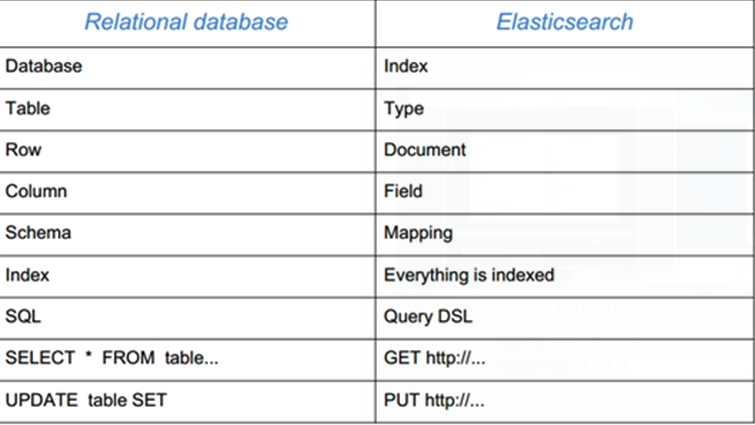
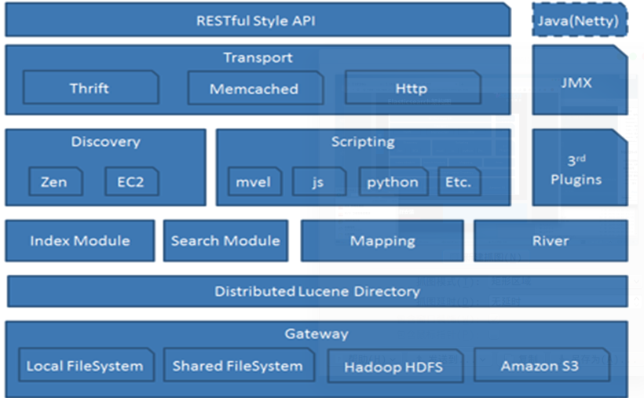

# 分布式ELK平台
##ELK简介
### 什么是ELK
	ELK是一整套解决方案,是是哪个软件产品的首字母缩写
    分别是
    - Elasticasearch: 负责日志检索和存储
    - Logstash: 负责日志的手机和分析,处理
    - Kibana: 负责日志的可视化
    - 三款软件都是开源软件,	都归Elastic.co公司名下,简称ELK
### ELK能做什么
	ELK组件在海量日志系统的运维中,可用于解决
    - 分布式日志数据集中式查询和管理
    - 系统监控,包含系统营救和应用各个组件的监控
    - 故障排查
    - 安全信息和事件管理
    - 报表功能
### ELK是什么样子
## Elasticasearch 

### Elasicsearch部分
	Elasticsearch是用java开发的,作为Apache许可条款下开发源码发布,是当前流行的企业级搜索引擎.设计用于云计算中,能够达到实时搜索,稳定,可靠,快速,安装使用方便.
    主要特点
    - 实时分析
    - 分布式实时文件存储,并将每一个字段都编入索引
    - 稳定导向,所有的对象全部是文档
    - 高可用性,易扩展,支持集群(Cluster),分片和复制(Shards和Replicas)
    - 友好的接口,支持json
    ES没有什么
    - Elasticsearch没有典型意义的事物
    - Elasticsearch是一种面向文档的数据库
    - Elasticsearch没有提供授权和认证特征
    相关概念
    - Node: 装有一个ES服务器的节点
    - Cluster: 有多个Node组成的集群
    - Document: 一个可被搜索的基础信息单元
    - Index: 拥有相似特征的文档的集合
    - Type: 一个索引中可以定义一种或多种类型
    - Filed: 是ES的最小单位,相当于数据的某一列
    - Shards: 索引的分片,每一个分片就是一个Shard
    - Replicas: 索引的拷贝
### SQL与NoSQL
	ES与关系型数据库的对比
    - 在ES中,文档归属于一种 类型(type) ,而这些类型存在于索引(index)中,类比传统关系型数据库
    - DB->Databases->Tables->Rows->Columns
    - 关系型 数据库      表     行       列
    - ES->Indics->Types->Documents->Fields
    - Es   索引     类型      文档      域(字段)

### Elasticasearch架构图

## ES集群安装

