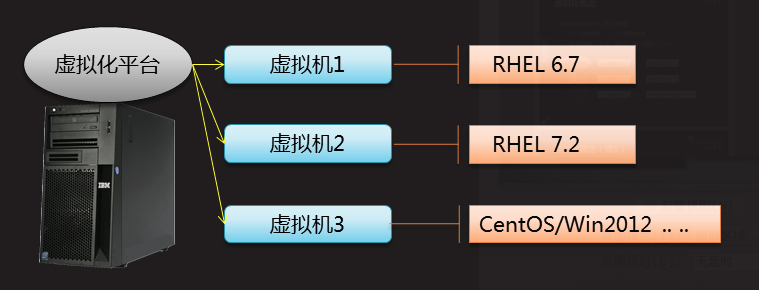

#kvm简介
[TOC]

### 搭建kvm服务器
#### 虚拟化概念
 - virtualization 资源管理
 - x个物理资源--> y个逻辑资源
 - 实现程度:完全,部分,营救辅助(cpu)


虚拟化主要厂商及产品


|系列|pc/服务器版本代表|
|-----|-------------|
|Microsoft|virtualPC,Hyper-V
|RedHat|kvm,rhev
|Citrix|Xen
|Oracle|Oracle VM VirtalBox

#### 安装虚拟化服务器
KVM/QEMU/LIBVIRTD
- KVM是Linux内核的模块,他需要cpu的主持,采用营救辅助虚拟化技术 Intel-VT,AMD-V.内存的相关如Intel的EPT和AMD的RVI技术
- QEMU是一个虚拟化的方针工具,通过ioctl与内核kvm交互完成对营救的虚拟化致辞
- Libvirt 是一个对虚拟化管理的几口和工具,提供用户端程序 virsh,virh-install,virt-manager,virtview与用户交互

必备软件
qemu-kvm
- 为kvm提供底层仿真支持
libvirt-daemon
- libvirtd守护进程,管理虚拟机
libvirt-client
- 用户端软件,提供客户端管理命令
libvirt-daemon-driver-qemu
- libvirtd 链接 qemu 的驱动

可选的功能

|命令|说明|
|---|----|
|vir-install | 系统安装工具|
|virt-manager| 图形管理工具
|virt-v2v|虚拟机迁移工具|
|virt-p2v|物理机迁移工具

虚拟化平台的安装
- yum install -y qemu-kvm libvirt-daemon libvirt-client libvirt-daemon-driver-qemu
- systemctl start libvirtd

#### kvm虚拟机的组成
虚拟机的组成
- 内核虚拟化模块(KVM)
- 系统设备仿真(QENU)
- 虚拟机管理程序(LIBVIRT)

- 一个XML文件(虚拟机配置声明文件)
- 位置 /etc/libvirt/qemu/
- 一个磁盘镜像文件(虚拟机的硬盘)
- 位置/var/lib/libvirt/images/
 
### 管理kvm平台
#### virsh命令工具介绍

提供管理个虚拟机的命令接口
- 支持交互模式,查看/创建/停止/关闭 ...
- 格式: virsh 控制指令 [虚拟机名称] [参数]

| 命令				| 功能		|
|---------------------|-----------|
| virsh nodeinfo |查看kvm节点(服务器)信息|
|virsh list [--all]|列出虚拟机
|virsh net-list [--all]|列出虚拟网络
|virsh dominfo 虚拟机名称|查看指定虚拟机的信息
|virsh start [reboot shutdown] 虚拟机名称| 运行 重启 关闭 指定的虚拟机
|virsh destroy 虚拟机名称|制关闭指定的虚拟机
|virsh autostart 虚拟机名称|将指定的虚拟机设为开启自动运行

#### 常用镜像盘类型
虚拟机的磁盘镜像文件格式

|特点\类型|raw|QCOW2|
|---------------|--------------|------------------|
|KVM默认|否|是
|I/O效率|高|较高
|占用空间|大|小
|压缩|不支持|支持
|后端盘复用|不支持|支持
|快照|不支持|支持

#### qemu-img命令
    - qemu-img 是虚拟机的磁盘管理命令,支持非常多的磁盘格式,列入raw,qcow2,vdi,vmdk等等
    - qemu-img命令格式
        -  qemu-img 命令 参数 块文件名称 大小
        -  常用的命令有
        -  create 创建一个磁盘
        -  convert 转换磁盘格式
        -  info		查看磁盘信息
    - 创建新的镜像盘文件
        - qemu-img create  -f 格式 磁盘路径 大小
        - qemu-img create  -f qcow2 disk.img 50G
    - 查询镜像盘文件的信息
        - qemu-img info 磁盘路径
        - qemu-img info disk.img
    - -b使用后端模板文件
        - qemu-img create -b disk.img -f qcow2 disk1.img   
	
#### COW技术原理
- Copy On Write ,写时复制
- 直接映射原始盘的数据内容
- 当原始盘的旧数据有修改时,在修改之前自动将旧数据存入前端盘
- 对前端的修改不会写到原始盘
-[](./images/cow.png)

## Virsh管理
### virsh虚拟机管理
#### 链接本地/远程kvm
	使用virsh客户端工具
    - 链接本地
    	- virsh
    	- virsh# connect qemu://system (默认选项)
    - 链接远程
    	- virsh# connect
    	- qemu+ssh://user@ip.xxx:port/system 
#### 虚拟机远程管理
	使用virt-manager客户端工具
    - virt-manager也可以通过 add connection 管理其它及其上的虚拟机,一般通过"remote tunnel over ssh" 就可以了
    - 需要之一的 virt-manager 需要使用ssh免密登录 如果灭有免密码登录需要单独暗转python 的ss相关模块,这里我们可以使用部署key的方法解决
#### 创建询价交换机
	libvirtd网络接口
    - 原理:调用dnsmasq 提供DNS,DHCP等功能
    - 创建配置文件/etc/libvirt/qemu/netwirks/vbr.xml
    <network>
    <name>vbr</name>
    <bridge name="vbr"/>
    <forward mode="nat"/>
    <ip address="192.168.1.254" netmask="255.255.255.0">
    	<dhcp>
        <range start="192.168.1.100" end="192.168.1.200"/>
       </dhcp>
     </ip>
    </network>
#### 网路管理
virsh管理虚拟网络

|命令|说明|
|---|---|
|net-list |查看虚拟网络
|net-define vbr.xml |创建虚拟网络
|net-undefind vbr|删除虚拟网络
|net-start vbr|启动虚拟机网络
|net-destroy vbr|停止虚拟网络
|net-edit vbr|修改vbr网络的配置
|net-autostart vbr|设置vbr虚拟网络开启自启动
### xml管理
#### 导出虚拟机
.xml配置文件
- 定义了一个虚拟机的名称,cpu,内存,虚拟机磁盘,网卡等各种参数设置
- 默认位于/etc/libvirt/qemu/虚拟机名.xml
导出xml配置文件
- 查看: virsh dumpxml 虚拟机命名
- 备份: virsh dumpxml 虚拟机名 > 虚拟机名.xml
#### 编辑虚拟机设置
对虚拟机的配置进行调整
-编辑: virsh edit 虚拟机名
-若修改name,memorty,disk,network,可自动保存位新虚拟机配置

```]#vir edit rhel-11
<domain type='kvm'>
 <name>rhel-11</name>
 <uuid>23545248-123413453-1234-24-32-4232323</uuid>
 <disk type="file" device='disk'>
   <source file='/var/lib/libvirt/images/rhel7.2qcow2'/>
   ...
   <interfave type='network'>
   <mac address='33:23:32:23:34:e2'/>
```
#### 导入虚拟机
根据修改后的独立xml文件定义新虚拟机
    - virsh define xml描述文件
    ]#virsh define /root/rhel-11.xm

    virsh list --all
    id 名称 状态
    - rhel-11 关闭

#### 删除虚拟机
	必要时可以取出多余的xml配置
    - 比如虚拟机改名的情况
    - 避免出现多个虚拟机的聪攀或MAC地址冲突
    - virsh undefine 虚拟机名
	]# virsh undefind rhel11

## 自定义虚拟机
####网络yum源的安装和配置
快速配置网络yum源
- 配置ftp 
- 	yuminstall vsftp -y
- 	修改配置文件 /etc/vsftpd/vsftpd.conf
- 	listem=YES
- 	listen_ipv6=NO
- 	systemctl enable vsftpd
- 	systemctl start vsftpd
- 	vsftp 默认根目录为/var/ftp

    在ftp根目录创建文件夹 Centos7
    把CentOS7的光盘挂在到刚刚创建的目录上
    mount-t iso9660 -o loop.ro /xx/xx.iso /var/ftp/centos7
    客户机里面配置yum源 /etc/yum.repos.d/xx.repo
        [cds]
        name=sdf
        baseurl=ftp://xxsdfs/centos7
        enabled=1
        gpgcheck=0
    	yum repolist
####virt-manager安装虚拟机
	图形化安装
### 虚拟机模板制作
####软件包安装及yum源配置
系统初始化
1.禁用selinux /etc/selinux/config
2.selinux=disabled
3.卸载防火墙与 NetworkManageer
4.yum remove -y NetworkManager-* firewalld-* python-firewall
5.配置yum源
6.安装软件
7.yum install -y lftp
8.按需导入gpgkey
9.rpm --import ftp://192.168.1.254/centos7/RPM-GPG-KEY-CentOS-7
10.安装常用系统命令安装
11.yum install -y net-tools vim-enhanced bridge-utils psmisc
12.删除网略陪孩子里面的个性化信息
13.- /etc/sysconfig/networl-scripts/ifcfg-eth0
14.		DEVIVE="eth0"
15.		ONBOOT='yes'
16.		IPV6INIT="no"
17.		TYPE="Ethernet"
18.		BOOTPROTO="dhcp"
19.	禁止空路由
20.	/etc/sysconfig/network
21.	NOZEROCONF="yes"
22.添加Console配置及删除磁盘分区里的个性化信息
23./etc/default/grub
24.	GRUP_CMDLINE_LINUX="biosdevname=0 net.ifnames=0 console=ttyS0,115200n8"
25.	GRUB_DISABLE_LINUX_UUID="true"
26.	GRUB_ENABLE_LINUX_LABEL="true"
27.重新生成grub.cfg
28.	grub2-mkconfig -o /boot/grub2/grub.cfg
29./etc/fstab 文件中到UUID手工修改成系统设备
30.blkid查看uuid对应的磁盘设备,修改fstab文件
	安装分区扩展软件
    yum install -y cloud-utils-growpart
    设置第一次开机自动扩容根目录
    chmod 755 /etc/rc.local
    根分区扩容
    /usr/bin/growpart /dev/vda 1
    /usr/sbin/xfs_frowfs /
    关闭虚拟机后执行信息清理工作
    virt-sysprep -d node
    

## 虚拟设备管理

###xml文件
####xml详解
	保存 node 虚拟机配置文件
    virsh dumpxml node >demo.xml
    清除模板配置
    virsh undefine node
    xml模板
    <!-- 注释开始
    ---> 注释结尾
    xml 标签必须成对出现
    <keyword>...</keyword>
    
####内存,cpu设置
	xml 配置文件
    <domain type='kvm' id='4'>
    <name>centos7.0</name>
    <uuid>84313-1312213.....</uuid>
    <memory unit="Kib">2097152</memory>
    <currentMemory unit="KiB"> 2097152</currentMemory>
    id=4个性化设置,去掉
    uuid 去掉
    memory unit 虚拟机最大使用内存,可以手调整
    currentmemory 创建虚拟机使用的内存
    xml 配置文件
    cpu 设置,可以调整
    	<vcpu plancement='static'>2</vcpu>
    资源设置,可以删除
    	<resource> ... </resource>
    系统配置及引导设备,不需要修改
    	<os>
        	<boot dev='hd/'>
         </os>
    电源相关配置无需修改
    	<features> ...</features>
     cpu 配置,可以修改成使用真机cpu
     <cpu .../>
     <cpu mode='host-passthrough'></cpu>
     始终相关配置,可以删除
     <clock ....></clock>
     重启,关机,强制关闭对应名
     <on_poweroff>destroy</on_poweroff>
     <on_reboot>restart</on_reboot>
     <on_crash>destroy</on_crash>
#### 磁盘设置
	xml 配置文件
    内存及硬盘休眠相关设置,可以删除
    <pm>....</pm>
    仿真设备相关配置
    <devices> ... </devices>
    其他配置
    驱动安装标签,可删除
    <seclabel>....</seclabel>
#### 硬件仿真设备
	总线地址,别名配置,都可以删除
    <address ..
    <alias ..
    硬盘配置,需要修改
    <emulator>/usr/libexec/qemu-kvm</emulator>
    <disk ...></disk>
    usb 相关设备配置,可以删除
    <controller type='usb'
    
    仿真设置配置
|参数类型|说明
|-------|---
|type='pci'|pci总线设备,可删除
|type='virtio-serial'|串口设备需要保留串口终端
|type='network' |网络配置需要修改
|type='pty' |串口终端,需要保留
|type='unix' |虚拟机通讯控制接口
|type='spicevmc'|图形图像相关配置可以删除
|type='tablet'|数位板,可以删除
|type='mounse'|鼠标,保留
|type='keyboard'|键盘,保留
|graphics,video|图形图像显卡相关配置
|sound|声卡相关配置,可以删除
|redirdev|设备重定向,可以删除
|memballoon|内存气泡,可以童泰调整内存
### 创建访问虚拟机
1.xml文件配置
- 复制xml模板文件,修改名称及磁盘文件
2.img文件创建
- 以我们刚刚装系统的模板位后端文件创建虚拟机
- qemu-img create -b node.qcow2 -f qcow2 node1.img
#### 快速创建虚拟机
完成注册虚拟机和启动
virsh defind node1.xml
virst start node1
virsh Console node


#### 离线访问虚拟机
使用guestmount
支持离线挂在 raw.qcow2 格式虚拟机磁盘
可以在虚拟机关机的情况下,直接修改磁盘中的文档
方便对虚拟机定制,修改,脚本维护
!!!!注意SELinux机制的影响
guestmount -a 虚拟机磁盘路径 -i /挂载点

guestmount -a node1.qcow2 -i /mnt/kdisk

