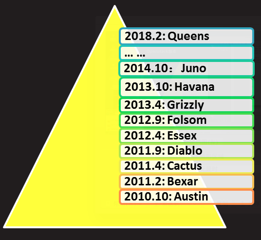
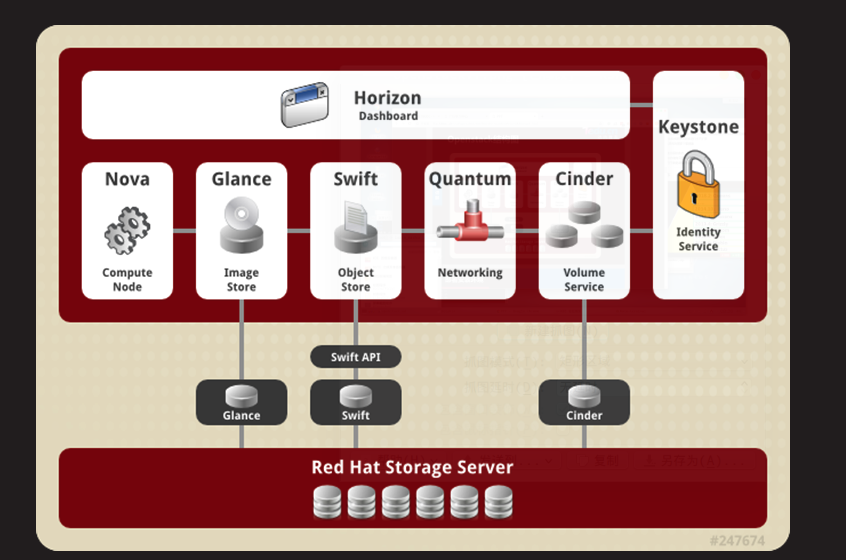

# openstack
## 云计算简介
### 什么是云计算
#### IaaS
Infrastructure as a Service 基础设施即服务
#### Paas
Platform-as-a-Service 平台即服务
#### SaaS
Software-as-a-Service 软件及服务
### Openstack简介
#### 什么是Openstack
Openstack是一个NASA(美国国家航空航天局)和Rackspace合作研发并发起的项目
OpenStacck是一套IaaS解决方案
OpenStack是一个开源的云计算管理平台
以Apache许可证位授权
#### Openstack主要组件
    Horizon
    - 用于管理Openstack各种服务的,基于web的管理接口
    - 通过图形界面实现创建用户,管理网络,启动实例等操作
    Keystone
    - 为其他服务提供认证和授权的集中身份管理服务
    - 也提供了集中的服务
    - 支持多种身份认证模式,如密码认证,令牌认证,以及AWS(亚马逊Web服务)登录
    - 位用户和其他服务提供SSO认证服务
    Neutron
    - 一种软件定义网络服务
    - 用于创建网络,子网,路由器,管理浮动IP地址
    - 可以实现虚拟交换机,虚拟路由器
    - 可用于在项目中创建VPN
    Cinder
    - 位虚拟机管理存储卷的服务
    - 为运行在Nova中的实例提供永久的块存储
    - 可以通过快照进行数据备份
    - 经常应用在实例额存储环境中,如数据库文件
    Nova
    - 在节点上用于管理虚拟机的服务
    - Nova是一个分布式的服务,能够与Keystone交互实现认证,与Glance交互实现镜像管理
    - Nova被设计成在标准硬件上能够进行水平扩展
    - 启动实例时,如果有则需要下载镜像
    Glance
    - 扮演虚拟机镜像注册的角色
    - 允许用户为直接存储拷贝服务器镜像
    - 这些镜像可以用于新建虚拟机的模板

#### Openstack版本

#### Openstack结构图

## 部署openstack
### 基础环境准备
### yum查看及名称解析
#### 配置yum仓库
Centos7 1708 光盘
RHEL7osp-10 光盘又有众多目录,每个目录都是一个仓库,隐藏需要把这些目录都配置位yum源
RHEL7-extras 扩展包光盘在安装的时候也是需要的

全部加入源
#### 设置DNS服务器
系统环境准备
- openstack 安装时候需要使用外部dns来解析域名,并且还需要外部世界服务器来保证所有节点的时间保持一致
- 我们需要创建一个dns服务器,并且位主机提供域名解析
- 将openstak.tedu.cn域名对应的ip解析到我们的安装Openstack的服务器
- **DNS服务器不能和Openstack安装在同一台主机上**

### NTP服务

#### 时区
#### UTC时间
#### 配置NTP服务
安装 yum install -y chrony
vim /etc/chrony.conf
//设置同步服务器时间服务器
pool asia.pool.ntp.org iburst prefer

binacqaddress 0.0.0.0
allow 0/.
cmdallow 127.0.0.1
#### 启动并测试
client
vim /etc/chrony.conf
server time.tedu.cn iburst
systemctl restart chronyd
chronyc sources -v
#### 环境准备
##### 配置ip地址
	配置eth0位公共网络,网络地址192.168.1.0/24
    配置eth1为隧道接口,网络地址192.168.2.0/24
    关闭NetworkManager服务
    禁用SELINUX
    卸载firewalld
    
##### 配置yum客户端
	配置 centos7-1708 源
    RHEL7-extars 
    RHEL7OSP-10
    
##### 配置卷组

##### 导入公钥
##### 安装额外软件包
##### 检查Openstack环境部署
####  安装Openstack
##### 配置packstack
##### 一键部署Openstack
####  网络配置
##### 网络拓扑
##### 查看外部ovs网桥
##### 查看外部ovs网桥端口
##### 验证ovs配置

