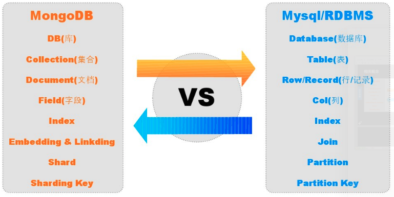
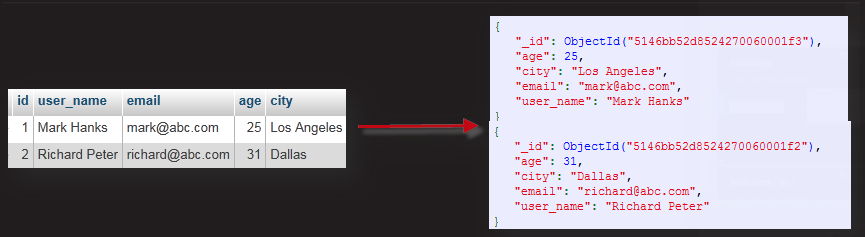
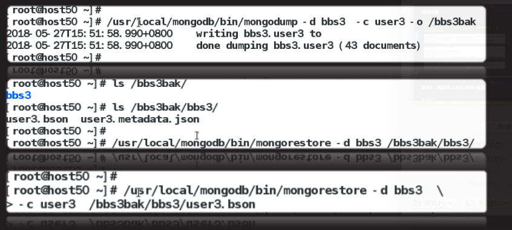
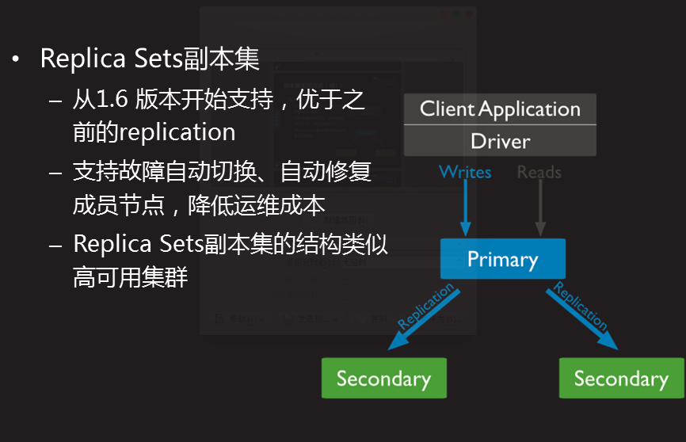

#MongoDB
	- 介于关系数据库和非关系数据库之间的产品
    - 一款基于分布式文件存储的数据库,旨在为web应用提供可扩展的高性能数据存储解决方案
    - 将数据存储为一个文档(类似与json对象),数据结构由键值(key=>value)
    - 支持丰富的查询表达,可以设置任何属性的索引
    - 支持副本集,分片

### 相关概念

####安装
	免安装个,解压后即可使用
#### 创建配置文件
	手动创建服务主配置文件
    vim /etc/mongodb.conf
    	logpath=/usr/local/mongodb/log/mongodb/log/mongodb.log
        logappend=true								//追加方式记录日志信息
        dbpath=/usr/local/mongodb/data/db			//数据库目录
        fork=true									//守护进程方式
        
    启动服务
    mongodb -f /etc/mongodb.conf
    查看进程
    ps -C mongod
    查看端口
    ss -anlpt|grep :27017
    
#### 链接服务
	本地链接,默认没有密码
    /usr/local/mongodb/bin/mongo
    
    show dbs //显示所有库
    exit	//断开连接
    
###常用管理命令

#### 数据库管理
查看,创建,切换,删除库

|命令|描述|
|-----|----|
|show dbs|//查看已有的库|
|db|//显示当前所在库|
|use 库名|//切换库,不存在延时创建|
|show clooections| 或 show tables //查看库下已有集合|
|db.dropDatabase()|//删除当前所在库|

  	数据库命名规范
        - 不能是空字符串("")
        - 不能包含''(空格),.,$,/,$,\和\0(空字符)
        - 应全部小写
        - 最多64字节
    
#### 集合管理
	查看,创建,删除集合
    	- show collections 或 show tables #查看集合
    	- db.集合名.drop()					#删除集合
    	- db.集合名.save({"",""})			#创建集合,不存在就先创建在添加文档
#### 文档管理
	集合名命名规范
    - 不能是空字符串""
    - 不能含有\0字符(空字符),次字符标识结合的结尾
    - 不能以 "system." 开头,还是位系统集合保留的前缀
    - 用户创建的集合名字不能含有保留字符
   
###基本数据类型
	文档:类似于Mysql表里的记录
   
	
    查看,统计,添加,删除文档
    - db.集合名.find()
    - db.集合名.count()
    - db.集合名.insert({"name":"jim"})
    - db.集合名.find({条件})
    - db.集合名.findOne()			//返回第一条文档
    - db.集合名.remove({})			//删除所有文档
    - db.集合名.remove({条件})		//删除匹配文档
    
    - db.集合名.update({条件},$set:{"name":"dd"}) //只更新name字段
    - db.集合名.update({条件},$inc:{"age":5}) //自增
    - db.集合名.update({条件},$unset:{"age":5}) //会移除age字段
    - db.集合名.update({条件},{"age":5},{upsert:true}) //如果条件没有命中,upsert属性会执行插入操作
    
     
#### 字符string/布尔bool/空null
	字符串string
    - UTF-8字符串都可以表示位字符串类型的数据
    - {name:"乘航"}或{school:"itsss"}
	
    布尔bool
    - 布尔类型有两个值true和false,{x:true}
    空null
    - 用于标识控制或不存在的字段,{x:null}
    
#### 数值/数组array
	数值
    -	shell默认使用64位浮点型数值. {x:3.14}或{x:3}
    -	NumberInt(4字节整数 ) {x:NumberInt(3)}
    -	numberLong(8字节整数) {x:NumberLong(3)}
    数组array
	-	数组列表或数据集可以标识为数组
	-	{x:["a","b","c"]}
#### 代码/日期/对象
	代码
    - 查询和文档中可以包括任何javascript代码
    - {x:function(){/**代码/}}
    日期
    - 日期被存储为1970101到现在的描述,不含时区 格林威治时间
    - {x:new Date()}
    对象
    - 对象id是一个12字节的字符串,是文档的唯一标识
    - {x:ObjectId()}
    -
#### 内嵌/正则表达式
	内嵌
    - 文档可以嵌套其他文档,被嵌套的文档作为值来处理
    - {t:{address:"bj",tel:"123456",person:"hansy"}}
	正则表达式
    - 查询时,使用正则表达式作为限定条件
    - {x:/正则表达式/}
    
###数据导入导出

#### 数据导出
	语法格式1:
		mongoexport [--host IP地址 --port 端口 ] -d 库名 -c 集合名 -f 字段名1,字段名2 --type csv > 目录/文件名.csv
    语法格式2:
    	mongoexport --host IP地址 --port 端口 -d 库名 -c 集合名 -q '{条件}' -f 字段名1,字段名2 --type=csv > 目录名/文件名.csv
        		**!!!导出为csv格式必须使用-f指定字段名列表!!!**
     语法格式3:
     	mongoexport [--host ip地址 --port 端口 -d 库名 -c 集合名 [-q '{重新条件}'] -f 字段名列表 -type json > 目录名/文件名.json]
        
#### 数据导入
	语法格式1:
     mongoimport --host ip地址 --port 端口 -d 库名 -c 集合名 --type json 目录名/文件名.json
	语法格式2:
     mongoimport --host IP地址 --port 端口 -d 库名 -c 集合名 --type csv [--headerline] [--drop] 目录名/文件名.csv
     	**导入数据时,若库和集合不存在,则先创建库和集合后再导入数据;
          若库和集合已存在,则以追加的方式导入数据到集合里;
          使用--drop选项可以删除原数据后导入新数据,--headrline 忽略标题
        **
###数据备份恢复

#### 数据备份
	备份数据所有库到当前目录下的dump目录下
		mongodump [ --host ip地址 --port 端口]
    备份时指定备份的库和备份目录
    	mongodump [--host ip地址 --port 端口] -d 数据库名 -c 集合名 -o 目录
    查看bson文件的内容
    bsondump ./dump/bbs/t1.bson

#### 数据恢复
	语法格式
    mongorestore --host ip地址 --port 端口 -d 数据库名 [ -c 集合名 ] 备份目录名
   
   
   
### mongodb 副本集

	
#### 配置Replica Sets
	启动服务时,指定主机所在副本集名称
    - 所有副本集成员使用相同的副本集名称
    - --replSet rs1       //指定副本集名称
    `mkdir -p /data/db`
    `./mongod --bind_ip 192.168.4.50 --logpath /var/log/mongod.log --replSet rs1 7`
    
#### 配置节点信息
    在任意一台主机链接mongod服务,执行
    `./mongo --host 192.168.4.50`
    use admin;
    config={
    _id:"rs1",
    members:[
    {_id:0,host:"ipAd:port"},
    {_id:1,host:"ipAd:port"},
    {_id:2,host:"ipAd:port"}
    ]
    };
    
    
#### 查看副本集信息
	查看状态信息
    	> rs.ststus()
    查看是否是master库
    	> rs.isMaster()
    
#### 验证副本集配置
    同步数据验证,允许从库查看数据
    	>db.getMongo().setSlaveOk()
    自动切换主库验证
    	>rs.isMaster()

#### 文档管理

##### 文档插入
	save()
    格式
    > db.集合名.save({key:"值",key:"值"})
    
    **集合不存在时创建集合,然后再插入记录
      _id字段值已经存在时,修改文件字段值
      _id字段值不存在时,插入文档
    **
    
    insert()
    格式
    > db.集合名.insert({key:"值",key:"值"})
    
    **集合不存在时创建集合,然后再插入记录
    _id字段值已存在时,放弃插入
    _id字段值不存在时,插入文档**
    
    插入多条记录
    > db.集合名.insertMany(
    > [
    	{name:"xx",age:19},
        {name:"dd",email:"ss@tedu.cn"}
    ]
    > )
    
##### 文档查询
	查询语法
        显示所有行(默认输出20行,输入it可显示后续行)
        > db.集合名.find()
    	显示第1行
        > db.集合名.findOne()
        指定查询条件并指定显示的字段
        > db.结合名.find({条件},{定义显示的字段})
        > db.user.find({},{_id:0,name:1,shell:1})   //0 不显示,1显示
        
    行数显示限制
    	limit(数字)
        > db.集合名.find().limit(3)  //显示前3行
        skip(数字)
        > db.集合名.find().skip(2)  //跳过前2行
        sort(字段名)
        > db.集合名.find().sort(age:1|-1)  //1升序 -1降序
        	sb.user.find({shell:"/sbin.nologin"}.{_id:0,name:1,uid:1,shell:1}).skip(2).limit(2); //参数:1 匹配条件,显示列.数值0代表不显示,1代表显示. 逻辑互斥的.设置值显示那么就只显示那些被设置的选项.如果设置了不显示的字段.那么除了设置不显示的就都显示.如果两种情况都出现. 就只展示设置显示的字段
    
    匹配条件
		
        简单条件
        db.集合名.find({key:"值"})
        
        范围比较
        - $in        在...里
        - $nin		 不在...里
        - $or		 或
        > db.user.find({uid:{$in:[1,6,9]}})
        > db.user.find({udi:{$nin:[1,6,9]}})
        > db.user.find({$or:[{name:"root"},{uid:1}])
        
        正则匹配
        > db.user.find({name:/^a/})
        
        数值比较
        -$lt $le $gt $gte $ne
        - <  <+   >  >=   !=
         db.user.find({uid:{$gte:10,$lte:40}},{_id:0,name:1,uid:1})
		匹配条件
         匹配null,也可以匹配没有的字段
         db.user.save({name:null,uid:null})
         db.user.find({name:null})
         db.user.find({"_id":ObjectId("5afd0ddbd42772e7e458fc75"),"name":null,uid:null})

##### 文档更新
	update
    	语法格式
          > db.集合名.update({条件},{修改的字段})
          	db.user3.update({uid:{$lte:3}},{password:"888"}) //文档会被替换为 只有password字段
            
    多文档更新
    语法格式:默认只更新与条件匹配的第一行
    >bd.user.update({条件},{$set:{修改的字段}},false,ture)
    	>db.user.update({name:"bin"},{$set:{password:"abc123123"}},false,true)

	$set/$unset
     $set 条件匹配时,修改指定字段的值
     >>db.user.update({条件},$set:{修改的字段})
     >>db.user3.update({name:"bin"},{$set:{password:"A"}})
     $unset 删除与条件匹配文档的字段
     	db.集合名.update({条件},{$unset:{key:values}})
        db.user3.update({name:"bin"},{$unset:{password:"A"}})
    
    $inc
    $inc 条件匹配时,字段值自加或自减$num
    > db.集合名.update({条件},{$inc:{字段名:数字}})
    > db.user.update({name:"bin"},{$inc:{uid:2}}) //字段值自加2. 可以是负数
    > db.user.update({name:"bin"},{$num:{uid:1}})  //字段值自减1
    
    $push/$addToSet
    	$push 想数组中添加新元素
        db.集合名.update({条件},{$push:{数组名:"值"}})
        
        >db.user.insert({name:"bob",likes:["a","b","c"]})
    	>db.user.update({name:"bob"},{$push:{likes:"w"}})
   	
    $addToSet 避免重新添加
    db.集合名.update({条件},{$addToSet:{数组名:"值"}})

	db.user.update({name:"bob"},{$addToSet:{likes:"f"}})
    
    $pop/$pull
    
    $pop 从数组头部删除一个元素
    	> db.集合名.update({条件},{$pop:{数组名:数字}})
    		> db.user.update({name:"bob"},{$pop:{likes:1}}) //-1 从数组头部pop元素. 1 数组尾部 pop元素
    	
        $pull 删除数组指定元素
        > db.集合名.update({条件},{$pull:{数组名:值}})
        	> db.user.update({name:"bob"},{$pull:{likes:"b"}})
        	
    
##### 文档删除
	drop()/remove()
    	$drop 删除集合的同事删除索引
        >db.集合名.drop()
        >db.user.drop)_
     
     $remove() 删除文档时不删除索引
     	> db.集合名.remove({}) 		//删除所有文档
     	> db.集合名.remove({条件})		//删除与条件匹配的文档
     	
        > db.user.remove({uid:{$lte:10}})
        > db.user.remove({})