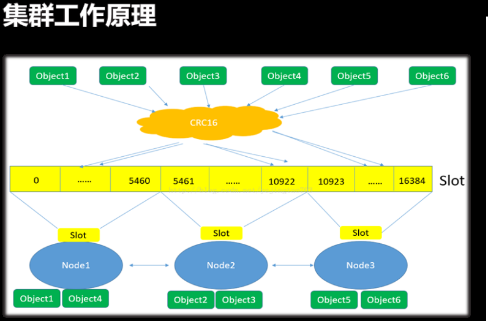

# redis管理
#### 创建集群

	装包 源码安装
    yum install -y gcc gcc-c++ 
    make && make intstall 
    ./utils/install_server.sh
    
    修改配置文件
    vim /etc/redis/redis.cof
    bind 绑定ip地址								  //绑定ip地址
    daemonize yes								//守护进程方式
    port xxxx									//端口号
    cluster-enabled yes							//启用集群
    cluster0config-file nodes-xxxx.conf			//指定集群信息文件
    cluster-node-timeout 5000                  //请求超时5秒
    
    vim /etc/init.d/redis_63779 status            //service 方式管理的配置文件
    											 //集群启动之后会有绑定端口加10000 端口出现
     
     安装ruby使用 创建集群脚本
     yum install -y ruby rubygems
     yum install ruby-devel-2.0.xxxx.rpm
     gem install redis-3.2.1.gem
     
     cd redis-3.2.0/src/
     ./redis-trib.rb create --replicas 1 host :port host:port ...
     	**replicas 1 自动位每一个master节点分配一个slave节点**
        
##### 查看集群
		redis-cli -h 192.168.4.51 -p 6351
        	> cluster info //查看集群信息
        	> cluster nodes //查看集群节点信息
    	log
        	cat /var/log/redis.log
            
            
##### 测试集群
		redis-cli -c -h ip地址 -p 端口 
        	> set key values 
        其他及其链接并get key 
       从库没有hash槽,
       
##### redis-cli 命令
		redis-cli -h
        常用选项
        	-h ip地址
            -p 端口
            -c 集群模式
##### redis-trib.rb脚本
		redis-trib.rb 选项 参数
        选项
        -add-node 添加master主机
        -check 检测集群
        -reshard 重新分片
        --add-node --slave       添加slave主机
        --del-node 删除主机
        
        
##### master 选举测试
	创建选举条件
    	停止master主机的redis服务
        - naster宕机后对应的slave自动被选举位mster
        - 原master穷后会自动配置位当前master的slave
        查看集群主机信息
        	redis-cli -h master_ip -p master_port
            	>cister info
            	>
##### 添加master主机
	添加是不指定主机角色,默认新主机被选为master
    ./redis-trib.rb add-node 新主机ip:端口
    192.168.4.51:6351
    
    
    检测集群主机
    ./redis-trib.rb check 192.168.4.51:6351
    主机角色为master
    无槽位数量
    
    
    重新分片
    ./redis-trib.rb reshard 192.168.4.51.:6351
    指定移出hast槽个数,
    指定接受hash槽主机id
    指定移出hash槽主机ID 如果该id不满足槽数量就
    
    移除master主机
    	重新分片释放占用的hash槽
        移除master主机
        
        redis-trib.rb reshard 192.168.4.51:6351
        redis-trib.rb del-node 192.168.4.51:6351 maste 主机id值
        
     redis-trob.rb常用选项
     create 创建集群
     check 检查集群
     reshard 重新分片
     del-node 删除主机
     add-node --slave主机
     add-node 	添加master主机
     
### redis 主从复制
##### 主从复制工作原理
		- slave向master发送sync命令
		- master启动后台存盘进程,收集所有修改数据命令
		- master完成后台存盘后,传送整个数据文件到slave
		- slave接收数据文件,加载到内存中完成首次完全同步
		- 后续有新数据产生时,master继续将新的数据传给slave,完成同步

		缺点
        - 网络繁忙,会产生数据同步延时问题
        - 系统繁忙,会产生数据同步延时问题

	配置主从同步
    临时修改本机 为slave master为 192.168.4.51
    > slaveof 192.168.4.51 6351
    > info replication
    
    永久修改
    vim /etc/redis.6379.conf
    salveof 192.168.4.51 6351
    masterauth 123123      //如果主库有密码 则需要设置此项
    
    slave临时恢复为master
    
    slaveof no one  //slave上执行次名利恢复master身份
    
##### 哨兵模式
		- 主库宕机后,从库自动升级为主库
		- 在slave主机编辑sentinel.conf文件
		- 在slave主机运行哨兵程序

	vim /etc/sentinel.conf
    sentinel monitor redis51 192.168.4.51 6351 1
    sentinel auth-pass redis51 密码 //如果连接主库需要密码
    
    redis-sentinel /etc/sentinel.conf
    
    sentinel monitor 主机名 ip地址 端口
    主机名:自定义
    ip地址: master主机的ip地址
    端口:master主机 redis服务使用的端口
    票数:有几台烧饼主机连接不上主库时,切换主库
### redis的持久化
##### RDB介绍
		redis数据库文件,redis DataBase
        - 数据持久化方式之一
        - 按照指定时间间隔,将内存中的数据快照写入硬盘
        - 属于叫Snapshot快照
        - 回复时,将快照文件直接读入内存

		相关配置参数
        	文件名
            - dbfilename "dump.rdb" //文件名
            - save "" //禁用RDB
        数据从内存保存到硬盘的频率
        	- save 900 1 //900秒内有1次修改
        	- save 300 10 //300秒内有10次修改
        	- save 60 10000 //60秒内且有10000次修改
       	手动存盘
        	- save       //阻塞写存盘
        	- bgsave	//不阻塞写存盘
        压缩
        	- rdbcomperssion yes|no
        在存储快照后,使用crc16算法做数据校验
        	- rdbchecksum yes|no
        bgsave 出错时停止写操作
        	- stop-writes-on-bgsave-error yes|no

		使用RDB文件恢复数据
        备份数据
        	- 备份dumo.rdb文件到其他位置
        		# cp 数据库目录/dump.rdb  备份目录
         恢复数据
         	- 拷贝备份文件到数据库目录,重新启动redis服务
         #cp 备份目录/dump.rdb 数据库目录/
         #/etc/redis/redis_端口 start
         
         RDB优点/缺点
         RDB优点
         	- 高性能的持久化实现 ---创建一个子进程来执行持久化,现将数据写入临时文件,持久化过程结束后,在用这个临时文件替换上次持久化好的文件;过程中主进程不做任何IO操作
         	- 比较适合大规模数据恢复,且对数据完整性要求不是非常高的场合
         RDB的缺点
         	- 意外宕机是,最后一次持久化的数据会丢失
    
    
##### 持久化之AOF
	只做追加操作的文件,Append Only File
   	- 记录redis服务所有写操作
   	- 不断地将新的写操作,追加到文件的末尾
   	- 使用cat命令可以查看文件内容
   	
    参数配置
    文件名
    	- appendfilename "appendonly.aof" 	//指定文件名
    	- appendonly yes 					//启用aof .默认no
    	AOF文件记录写操作的方式
        - appendfsync always 				//有新写操作立即记录
        - appendfsync everysec				//没秒记录一次
        - appendfsync no					//从不记录
     
     日志文件会不端增大,合适触发日志重新写入?
     	-redis会几率上次重新写入时AOF文件的大小
        -默认配置当aof文件是上次rewrite后大小的1倍且文件大于64m时触发
        
        	> auto-aof-rewrite-oercentage 100
        	> auto-aof-rewrite-min-size 64mb

		修复AOF文件 (什么情况下需要修复aof文件)
        	- 把文件恢复到最后一次的正确操作
        	- redis-check-aof --fix appendonly.aof
		
        使用aof文件恢复数据
        	备份数据
            - 备份appendonly.aof文件到其他位置
            	# cp 数据库目录/appendonly.aof 备份目录
            恢复数据
            - 拷贝备份文件到数据库目录,重启redis服务
            	# cp 备份目录/appendonly.aof 数据库目录/
                # service redis_6397 restart
                
                
         AOF优点/缺点
         
         AOF优点
         -	可以灵活设置持久化方式,同步持久化appendfsyncalways 或 一步持久化appendfsync everysec 
         
         AOF缺点
         - 持久化文件的体积通常会大于RDB方式
         - 执行fsync策略时的速度可能会比RDB方式慢

	
    
#### redis 数据类型

		string
        字符串操作
        set key value [ex seconds] [px milliseconds] [nx|xx]  XxX 如果键不存在新建,默认就是XX模式
        - 设置key及值,过期时间可以使用秒或毫秒为单位
        setrange key offset value
        - 从偏移量开始复写key的特定位的值
        
        	>set first "hello world"
        	>setrange first 6 "Redis"   //从first键的值的第6位后面开始写入Redis字符串
        	
            strlen key,统计字符串长度
            >	strlen first  			//返回first键的值的字符串长度
          	
            字符串操作
            append key value
            - 存在则追加,不存在则创建key及value,返回key长度
             > append myname "makeit"
             setbit key offset value
             - 对key所存储字符串,设置或清除特定偏移量上的位(bit)
             - value值可以位1或0,offset位0~2^32之间 65535
             - key不存在,则创建新key
             	> setbit bit 0 1
             	> setbit bit 1 0
             
             bitcount key
             	统计字符串中位设置为1的比特位数量
             > setbit bits 0 1            ///0001
             > setbit bits 3 1            ///1001   01001 所以是2位.
             bitcount bits                //结果为2
             
             setbit peter 100 1 		//场景 网站上线100天用户登录了一次
             setbit peter 105 1			//	  网站上线105天用户登录了一次
             bitcount peter				//    返回bit位被值1的数量
             get peter           //"C\xe0\x00\x00\x00\x00\x00\x00\x00\x00\x00\x00\b@" 16进制显示方式
             
             get key 
             返回key从年初的字符串值,若key不存在则返回null
             若key的值不是字符串,	则返回错误,get只能处理字符串
             
             getrange key start end
             - 返回字符串值中的字符串,截取范围位start和end
             - 附属偏移量标识从末尾开始技术,-1标识最后一个字符,-2标识倒数第二个字符.
             
             > set first "hello ,the world"
             > getrange first -5 -1
             > getrange first 0 4
           incr key
           	- 将key的值加1,
#### list列表
	Redis的list是一个字符列队
        先进后出
        一个key可有有多个值
        
        list列表操作
        
        lpush key value [value...]
        将一个或多个值value插入到列表key的表头
        key不存在,则创建key
        >lpush list a b c //list1值依次为c,b,a
        lrange key start stop
        - 从开始位置读取key的值到stop结束
        > lrange list 0 2 			//从0位开始,读到2位为止
        > lrange list 0 -1			//从开始读到结束为止
        > lrange list 0 -2          //从开始读到倒数第2位为止
        
        lpop key
        	- 移除并返回列表头元素数据,key不存在则返回nil
        	- >lpop list			//删除表头元素,可以多次执行
        	-llen key
            	返回列表key的长度
                
                
        列表的操作
        lindex key index
        返回列表第index个值
        > lindex key 0; index key 2; index key -2
        lset key index value
        将key中index 位置的值修改位value
        >lset list 3 test
        
        rpush key value [value ...]
        - 将value插入到key的末尾
        > rpush list3 a b c //list3 值位a b c
        > rpush list3 d     //末尾插入d
        rpop key
        删除并返回key末尾的值
        >rpush list4 a b c   //list4值位 a b c
        >rpop list4	          //删除末尾的c ,并返回删除的值
	
##### hash表
	redis hash
        是一个string类型的field和value的映射表
        一个key可对应多个field,一个field对应一个value
        将一个对象存储位hash类型,较于每个字段都存储成string类型更能节省内存
        
        hset key field value
        将hash表中field值设置位value
           >hset site google 'www.g.cn'
           >hset site baidu   'www.baidu.com'
            >
        hget key filed 
        	获取hash表中field的值
            >hget site google
        hmset key field value [field value...]
        	- 同时给hash表中的多个field赋值
        	>hmset sit google www.g.cn baidu www.baidu.con
        	>
       	hmget key field [field...]
        	- 返回hash表中多个field的值
        	> hmget site google baidu
        hkeys key
        	- 返回hash表中所有field名称
        	hmset site google www.g.cn baidu www.baidu.com
            hkeys site
            
        hgetall key
        	- 返回hash表中所有可以名和对应的值列表
        hvals key
        	- 返回hash表中所有key的值
        	> havals key
        hdel key field [field ...]
        	- 删除hash表中多个field的值,不存在忽略
        	hdel site google baidu
            
