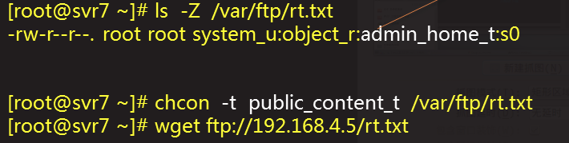

#Linux 服务安全与监控
[toc]
##Linux 基本防护
###账号安全
#### 设置账户有效期
	使用chage工具
    - -d 0,强制修改密码
    - -E yyyy-mm-dd,指定失效日期(-1 取消)
#### 账号的锁定/解锁
	passwd命令
    - -l 锁定
    - -u 解锁
    - -S 查看状态
    
#### 强制定期修改密码
	配置文件/etc/login.defs
    - 对新建的用户有效
    主要控制属性有
    - PASS_MAX_DAYS
    - PASS_MIN_DAYS
    - PASS_WARN_AGE
   
#### 伪装登录提示
	配置文件/etc/issue./etc/issue.net
    - 分表使用于本地,远程登录
    - 默认会提示内核,系统等版本信息
    
### 文件系统安全
#### 程序和服务控制
	禁用非必要的系统服务
    - 使用systemctl,chkconfig工具
    
#### 锁定/解锁保护文件
	EXT3/EXT4的文件属性控制
    -	chattr , lsattr
    -	+,-,= 控制方式
    -	属性i:使文件不可变(immutable)
    -	属性a:使文件仅可追加(append only)

	**不更新atime(A),同步更新(S),只能添加(a),**
    **压缩(c),不可变(i),不可转移(d),删除保护(s)以及不可删除(u).**

### 登录和服务
#### su切换的基本用法
	Substitute User 换人
    - 快速切换为指定的其他用户
    - 普通用户执行时,需验证目标用户的口令
    - root执行时,无需验证口令
    
    命令格式
    - 用法1: su [-] [目标用户] 不指定时候使用root
    - 用法2: su [-] -c "命令" [目标用户] 
     whoami //显示当前用户
     
     安全日志/var/log/secure
     -	记录su验证,shell开启与关闭
    	Mar  6 09:01:13 learn_machine login: pam_unix(login:session): session opened for user root by LOGIN(uid=0)
		Mar  6 09:37:01 learn_machine login: pam_unix(login:session): session closed for user root
        
#### sudo提升执行权限
	Super or another Do 超级执行
    - 管理员预先为用户执行许可
    - 被授权用户有执行授权的命令,验证自己的口令
    命令格式
    - 用法1: sudo 特权命令
    - 用法2: sudo [-u 目标用户] 特权命令
    查看自己的sudo授权
    - sudo -l
    case 以用户ack的生新建立一个文件夹
    - sudo -u ack mkdir /tmp/mydir
    
    配置sudo授权
   	visudo or vim /etc/sudoers
    授权记录格式
    - 用户 主机列表=命令列表
    - grep ^root /etc/sudoers
	root		ALL=(ALL) 		ALL
    可以是%组名 	目标身份,省略root
    
    case 允许ack以root权限执行/sbin/下的所有命令
    但是,进制修改eth0网卡的参数
    visudo
    akk        localhost,网络主机,ip=/sbin/*,!/sbin/ifconfig eth0
    case2
    使wheel组的用户无需验证可以执行所有命令
    visudo
    %wheel 				ALL=(ALL)	NOPASSWD:ALL
	名称前面加%代表是一个组
    
	分析sudo提权的使用权限的使用情况
    1.修改全局配置,启用日志
    	- Defaults logfile="/var/log/sudo"
    
    sudo 别名设置
    	主要用途
        -提高可重用性,易读性
        -简化配置,使记录更有条理
        visudo
        User_Alias OPERATORS=jerry,tom
        Host_Alias MAILSERVERS=mail,smtp,pop,svr7
        Cmnd_Alias SOFTMGR=/bin/rpm,/usr/bin/yum
        
        OPERATORS MAILSERVERS=SOFTMGR
        
## ssh访问控制
### ssh基本防护
####sshd访问概述
	存在安全隐患
    - 密码嗅探,键盘记录
    - 表里枚举账号,猜解密码
    蔡姐的防护措施
    - 用户显示,黑白名单
    - 更改验证方式(密码-->秘钥对)
    - 防火墙
    
####基本安全配置
	vim /etc/ssh/sshd_config
    - port 3389 		//改用非标准端口
    - protocol	2		//启用sshV2版协议
    - listenadress 192.168.4.50  仅监听指定ip
    - PermitROOTLogin no	//进制root登录
    - UseDNS no				//不计息客户机地址
    - LoginGraceTime 1m		//登录限时???
    - MaxAuthTries 3 		//每次链接最多认证次数
    
####sshd黑/白名单配置
		vim /etc/ssh/sshd_config
        - DenyUsers user1 user2 
        - AllowUsers	user1@host
        - DenyGroups group1 group2
        - allowGroups group1 group2
        
        case 仅允许一部分用户(从指定地址)登入
        其他任何用户进制登录
       	
        vim /etc/ssh/sshd_config
		AllowUsers zangsan@192.168.0.*,192.168.4.50
        AllowUsers dachui tom fucktom
        
        #systemctl restart sshd
        
### ssh密匙对验证
		sshd 验证方式
        口令验证
        	- 检查登录用户的口令是否一致
        密钥验证
        	- 检查客户端私钥与服务器上的公钥是否匹配
        		PasswordAuthentication yes
                PubkeyAuthentication yes
                AuthorizedKeysFile .ssh/authorized_keys
                					公钥库:存放授权客户机的公钥文本
#### 密钥对验证的实现思路

#### 创建ssh秘钥对
    ssh-keygen 
    	可以手动指定加密算法(-t rsa 或 -t dsa)
        若不指定,默认采用rsa加密
        
#### 部署ssh公钥
     方法一.通过ssh-copy-id 自动部署
     -好处 一步到位
     -局限性 要求ssh口令认证
     方法二,通过ftp等方式上传手动添加
     -好处 灵活,适用范围广
     -局限性 操作繁琐 易出错

#### 测试ssh密钥对验证
	ssh 用户@目标机器
    
## SELinux 安全防护
### SELinux概述 
#### SELinux简介
Security-Enhanced Linux
	- 一淘强化Linux安全的扩展模块
	- 美国国家安全局主导开发
SELinux的运作机制
	- 记成到Lnuix内核(2.6及以上)
	- 操作系统提供可定制的策略,管理工具
#### 红帽的SELinux策略集
	SELINUXTYPE=targeted
    - 推荐，仅保护最常见／㡱的网络服务，其他不限制
    - 主要软件包：
    	selinux-policy,selinux-policy-targetd,
        libselinux-utils,libselinux-utils,
        coreutils,policycoreutils
        
        #sestatus   查看selinux 状态
#### SELinux模式控制
	操作模式 启动 禁用
    修改kernel启动参数
    - 添加 selinux=0 禁用
    - 添加 enforcing=0 设置 色林旭位允许模式
    
    第二种方法 vim /etc/selinux/config
    	SELINUX=disabled 禁用
        SELINUX=permissive 宽松/允许模式
        SELINUX=enforcing 强制模式
    
    临时调整
    setenforce 1 强制模式  0 宽松模式
    getenforce 查看模式
    
### SELinux策略设置
#### 查看安全上下文
	Security Context , 安全上下文
    	为文件/目录/设置标记访问控制属性
    属性构成
    	用户:较色:方位类型:选项...
        ls -Z /bin/ls  /etc/fstab
        
        -rwxr-xr-x. root root system_u:object_r:bin_t:s0       /bin/ls
		-rw-r--r--. root root system_u:object_r:etc_t:s0       /etc/fstab

#### 修改安全上下文
	使用 chcon 工具
    - -t 指定访问类型
    - -R 递归修改
    一般操作规律
    移动的文件,原有的上下文属性不变
    复制的文件,自动继承目标位置的上下文
    
    case 一个权限位644文件,但是FTP无权下载

#### 重置安全上下文
	使用restorecon 工具
    restorecon 文件
    - 恢复位所在位置的默认上下文属性
    - -R 递归修改
    ./autorelabel文件
    - 下次重新启动后全部重置
#### 调整SELinux布尔值
	使用getsebool 查看布尔值
    getsebool -a	 列出所有布尔值
    使用 setsebool
    setsebool -p  //-p是永久修改