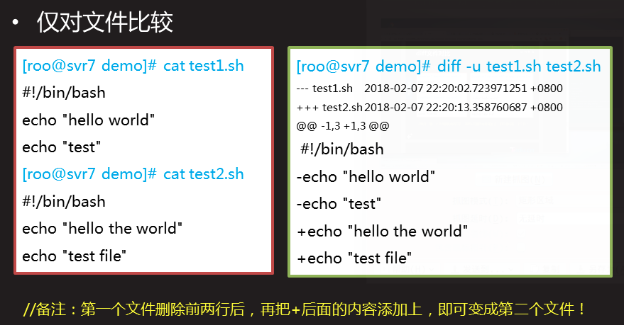
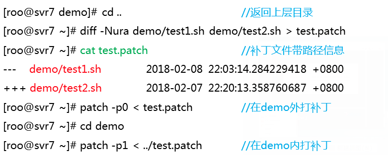
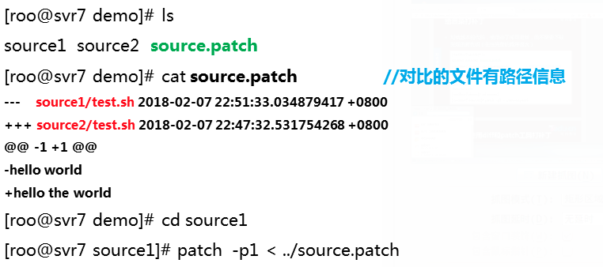

# 系统审计／服务安全和打补丁
[TOC]
## 系统审计
#### 什么是审计
	- 基于事件先配置的规则生成日志,记录可能发生在系统上的事件
    - 审计不会位系统提供格外的安全防护,但他会发现并记录违法安全策略的人及其对应的行为
    - 审计能够几率的日志内容:
    	- 日期与事件,事件结果
    	- 触发事件的用户
    	- 触发事件的用户
    	- 所有认证机制的使用都可以被记录,如ssh等
    	- 对关键数据文件的修改行为等
    	
#### 审计的案例
 - 监控文件访问
 - 监控系统调用
 - 记录用户运行的命令
 - 审计可以监控网络访问行为
 - ausearch工具,可以根据条件过滤审计日志
 - aureport工具,可以生成审计报告
 
#### 部署andit
	慎用审计系统需要安装audit软件包
    主配置文件为/etc/audit/auditd.conf
    
    yum -y install audit
    cat /etc/audit/auditd.conf
    log_file=/var/log/audit/audit.log 		//日志文件
    systemctl start auditd
    systemctl enable auditd
### 配置审计
#### alditctl命令
 - auditctl命令控制审计系统并设置规则决定哪些行为会被记录日志.
 	- auditctl -s  //查询状态
 	- auditctl -l  //查看规则
 	- auditctl -D  //生成所有规则 
 	
#### 定义临时规则
 - 定义文件系统规则,语法如下:
 	- auditctl -w path -p permission -k key_name
 	- path为需要审计的文件或目录
 	- 权限可以是r,w,x,a(文件或目录的属性发生变化)
 	- Key_name位可选,方便识别哪些规则生成特定的日志项
            //设置规则所有对passwd文件的写,属性修改操作都会被记录审计日志
            audit -w /etc/passwd -p wa -k passwd_chage
            //设置规则,监控/etc/selinux目录
            autdit -w /etc/passwd -p wa -k passwd_change 
            //设置规则,监控fdisk
            audit -w /usr/sbin/fdisk -p x -k disk_partition
            
        
#### 定义永久规则
    写入配置文件/etc/audit/relues.d/audit.rules
    	vim /etc/audit/rules.d/audit.rules
        -w /etc/passwd -p wa -k passwd_changes
        -w /usr/sbin/fdisk -p x -k partition_disks
     
#### 附加扩展
	系统提供的参考模板
    ls /usr/share/doc/autit-版本号/rules/
    
### 审计日志
#### 查看日志
	定义规则
    	auditctl -w /etc/ssh/sshd_conf -p awrx -k sshd_config
    查看日志
    	tailf /var/log/audit/audit.log
        
    type=CRED_DISP msg=audit(1552046461.971:887): pid=17165 uid=0 auid=0 ses=81 subj=system_u:system_r:crond_t:s0-s0:c0.c1023 msg='op=PAM:setcred grantors=pam_env,pam_unix acct="root" exe="/usr/sbin/crond" hostname=? addr=? terminal=cron res=success'
    type=USER_END msg=audit(1552046461.971:888): pid=17165 uid=0 auid=0 ses=81 subj=system_u:system_r:crond_t:s0-s0:c0.c1023 msg='op=PAM:session_close grantors=pam_loginuid,pam_keyinit,pam_limits,pam_systemd acct="root" exe="/usr/sbin/crond" hostname=? addr=? terminal=cron res=success'

#### 搜索日志
     - type为类型
     - msg为(time_stamp:ID),时间是date+%s
     - arch=c000003e,代表x86_64(16进制)
     - success=yes/no,事件是否成功
     - a0-a3是程序调用时前4个参数,16进制编码了
     - ppid父进程ID,如bash,pid进制ID,如cat命令
     - audit是审核用户的id,su - test,依然可以追踪su前的账户
     - uid,gid用户与组
     - tty从那个终端执行的命令
     - comm="cat" 用户在命令行执行的指令
     - exe="/bin/cat" 实际程序的路径
     - key="sshd_config" 管理员定义的策略关键字key
     - type=CWD	用来记录当前工作目录
        - cwd="/home/username"
     - type=PATH
        - ouid(owner's user id) 对象所有者id
        - guid(owner's groupid) 对象所有者id	 
 
     系统提供的auusearch命令可以方便的搜索特定日志
      - 默认该程序会搜索/var/log/audit/audit.log
      - ausearch options -if file_name可以指定文件名

      //根据key搜索日志,-i为交互式操作
      # ausearch -k sshd_config -i
    

## 服务安全
### Nginx安全
#### 删除不需要的模块
   - Nginx是模块化设计
    - 需要的模块使用 --with加载模块
    - 不需要的模块使用 --without禁用模块
    - 最小化安装永远是对的!!!
    case 
    ./configure --without-http_autoindex_module --without-http_ssi_module
    make
    make install
    
#### 修改版本信息
	修改版本信息(修改源码)
    vim src/http/ngx_http_header_filter_module.c
    	static u_char ngx_http_server_string[]="Server.nginx" CRLF;
        static u_char ngx_http_server_full_string[]="Server: NGINX_VER CRLF;
        static u_char ngx_http_server_build_string[]="Server:" NGINX_VER_BUILD CRLF;
        
#### 限制并发
	ngx_http_limit_req_module为默认模块
    - 该模块可以降低DDos攻击风险
    vim /usr/local/nginx/conf/nginx.conf
    http{
    limit_req_zone $binary_remote_addr zone=one:10m rate=1r/s;
    	server{
        listen 80;
        server_name localhost;
        limit_req zone=one burst=5;
        }
    }
    
    下面配置的功能为:
    - 语法:limit_req_zone key zone=name:size rate=rate;
    - 将客户端IP信息存储名称位one的共享内存,空间位10M
    - 1M可以存储8千个IP的信息,10M存储月8万个主机状态
    - 每秒钟仅接受1个请求,多余的放入漏斗
    - 漏斗超过5个则报错
    
    limit_req_zone $binary_remote_addr zone=one:10 rate=1r/s;
    limit_req zone=one burst=5;
    > ab -c 100 -n 100 http://192.168.4.50/
    
#### 拒绝非法请求
	禁用其他方法,仅允许(GET|POST)
    vim /usr/local/nginx/conf/nginx.conf
    http{
    	server{
        	listen 80;
            if($request_method !~ ^(GET|POST)$){
            	return 444;
            }
        }
    }
    
#### 防止buffer溢出
	防止客户端请求数据溢出
    有效降低机器Dos攻击风险
    
    vim /usr/local/nginx/conf/nginx.conf
    http{
    	client_body_buffer_size 1K;
        client_header_buffer_size 1k;
        client_max_body_size 16k;
        large_client_header_buffers 4 4k;
    }

## 数据库安全
#### 初始化安全脚本
    输入旧密码,配置新root密码
     Remove anonymous users(删除匿名账号)
     Disallow root login remotely? (禁止root远程登录)
     Remove test database (删除测试数据库)
     Reload privilege(刷新权限)
 
 mysql_secure_installation //执行初始化安全脚本
#### 密码安全
	修改MySQL密码的若干方法
    mysqladmin -uroot -predhat password 'mysql'  //修改密码
    set password for root@'localhost'=password('redhat')
    历史记录会暴露很多信息
### Tomcat安全
#### 隐藏版本信息
	习惯tomcat主配置文件,隐藏版本信息
    tomcat > yum -y install java-1.8.0-openjdk-devel
    tomcat > cd lib/ ; jar -xf catalina.jar
    tomcat > vim org/apache/catalina/util/ServerInfo.properties //修改内容
    tomcat > vim /usr/local/tomcat/conf/server.xml
    <Connector port="8080" protocol="HTTP/1.1"
    connectopnTimeout="20000" redirectPort="8443" server="jacob" />
    
    测试
    curl -I http://192.168.4.50:8080/xx
		[root@localhost bin]# curl -I http://192.168.4.50:8080/xx
            HTTP/1.1 404 Not Found
            Content-Type: text/html;charset=utf-8
            Content-Language: en
            Content-Length: 998
            Date: Fri, 08 Mar 2019 08:46:47 GMT
            Server: lvusyy.makeit
#### 降权启动
	受用非root启动tomcat服务
    > useradd tomcat
    > chown -R tomcat:tomcat /usr/local/tomccat/
    > su -c /usr/local/tomcat/bin/startup.sh tomcat
#### 开机启动
	chmod +x /etc/rc.local
    vim /etc/rc.local		//添加
    su -c /usr/local/tomcat/bin/startup.sh tomcat
#### 删除默认的测试页面
	rm -rf /usr/local/tomcat/webapps/*
#### 加固场景服务的安全
    优化nginx服务的安全配置
    优化mysql数据库的安全配置
    优化tomcat的安全配置
    
##Linux安全打补丁
###补丁的原理
#### 源代码的不同版本
	* V1版本
		 cat test1.sh
		 #!/bin/bash
		 echo "hello world"
	* V2版本
		cat test2.sh
        #!/bin/bash
        echo "hello world"
        echo "test file"
#### diff逐行比较
	diff的原则是:
    	告诉我们怎么修改第一个文件后能得到第二个文件
    选项
    	- -u 输出统一内容的头部信息(打补丁使用)
        - -r 递归对比目录中的所有资源(可以对比目录)
        - -a 所有文件视为文本(包括二进制程序)
        - -N 无文件视为空文件(空文件怎么变成第二个文件)
        //A目录下没有txt,B目录下有txt文件
        //diff比较两个目录时,默认 会提示txt仅在B目录有(无法根据补丁修复A的文件)
        //diff比较时使用N选项,则diff会拿B下的txt与A下的空文件对比
        //补丁信息会明确说明如何从空文件修改后变成txt文件,打补丁即可成功!
        
#### diff文件对比

#### diff目录对比
	准备环境
    mkdir {s1,s2}
    echo "hello world" >s1/test.sh
    echo "hello the world">s2/test.sh
    echo "test" >s2/tmp.txt
    cp /bin/find s1/
    cp /bin/find s2/
    echo "1" >>s2/find
    
    对比差异
    
    diff -u s1/ s2/ #金对比了文本文件test.sh ;二进制文件,tmp都没有对比差异,仅提示
    Binary files s1/find and s2/find differ
    diff -u s1/test.sh s2/test.sh
    --- s1/test.sh	2019-03-08 17:48:41.658802086 +0800
    +++ s2/test.sh	2019-03-08 17:48:41.659802086 +0800
    @@ -1 +1 @@
    -hello world
    +hello the world
    只在 s2/ 存在：tmp.txt

	
    # diff -Nu s1/ s2/    #仅对比了test.sh 并且使用s2目录的tmp.txt与s1的空文件对比差异
    Binary files s1/find and s2/find differ
    diff -Nu s1/test.sh s2/test.sh
    --- s1/test.sh	2019-03-08 17:48:41.658802086 +0800
    +++ s2/test.sh	2019-03-08 17:48:41.659802086 +0800
    @@ -1 +1 @@
    -hello world
    +hello the world
    diff -Nu s1/tmp.txt s2/tmp.txt
    --- s1/tmp.txt	1970-01-01 08:00:00.000000000 +0800
    +++ s2/tmp.txt	2019-03-08 17:48:41.659802086 +0800
    @@ -0,0 +1 @@
    +test

	#diff -Nua s1/ s2/
    //仅对比了test.sh,tmp.txt,find(程序)
    

### patch打补丁

#### 给文件生成补丁

    patch [oiption] [originalfile [patchfile]]
    常用参数：

    -i 指定补丁文件
    -p num 在 diff 生成的 patch 中，第一二行是文件信息，其中文件名是可以包含路径的，例如 --- /tmp/test1 2018-05-12 18:39:41.508375114 +0800 其中 -p0 代表完整的路径 /tmp/test1，而 -p1 则指 tmp/test1,-pN 依此类推
    -E 删除应用补丁后为空文件的文件
    -o 输出到一个文件而不是直接覆盖文件

	diff -Nua t1.sh t2.sh > test.patch
    
    
    
#### 给文件打补丁
	对旧版本的代码,使用补丁即可更新,而不需要下载完成的新代码 (完整的程序往往很大)
    yum -y install patch
    path -p0 <test.patch
    
    patch -RE <test.patch ///还原旧版本,反向修复
    //path -pnum指定删除补丁文件中多少层路径前缀
    //如原始路径为/u/howard/src/blurfl/blurfl.c
    //-p0则整个路径不变
    //-p1则修改路径位u/howard/src/blurfl/blurfl.c
    //-p4则修改路径位blurfl/blurfl.c
    //-R(reverse)反向修复,-E修复后如果文件为空,则删除该文件
    
    在不同目录生成补丁文件

    
#### 给目录生成补丁
 
#### 给目录打补丁
	使用前面创建的目录环境

#### 给目录打补丁
	对版本的代码,使用补丁即可更新,而不需要下载完成的新代码()
   